# Project Brahmaputra

## AI-Based Smart Logistics & Accessibility Intelligence Platform for the North Eastern Region

### Complete System Description, Architecture, Features & Component Reference

---

## Table of Contents

1. [Executive Summary & Problem Statement](#1-executive-summary--problem-statement)
2. [Target Region, Operational Context & Intended Users](#2-target-region-operational-context--intended-users)
3. [End-to-End System Overview](#3-end-to-end-system-overview)
4. [Master Feature Inventory & Implementation Status](#4-master-feature-inventory--implementation-status)
5. [Technology Stack & Dependency Breakdown](#5-technology-stack--dependency-breakdown)
6. [High-Level Architecture & Layer Interactions](#6-high-level-architecture--layer-interactions)
7. [Repository & Directory Structure](#7-repository--directory-structure)
8. [User Roles & RBAC Architecture](#8-user-roles--rbac-architecture)
9. [Authentication & Session Management](#9-authentication--session-management)
10. [Resource Ownership, Multi-Tenancy & Anti-IDOR Protections](#10-resource-ownership-multi-tenancy--anti-idor-protections)
11. [User / Operator Portal Walkthrough](#11-user--operator-portal-walkthrough)
12. [Mobile Application & PWA Experience](#12-mobile-application--pwa-experience)
13. [Vehicle Registration Architecture & Validation](#13-vehicle-registration-architecture--validation)
14. [Vehicle Fleet Management & Directory](#14-vehicle-fleet-management--directory)
15. [Vehicle Lifecycle & State Machine](#15-vehicle-lifecycle--state-machine)
16. [Deployment & Journey Management (1:N Asset-to-Trip Model)](#16-deployment--journey-management-1n-asset-to-trip-model)
17. [Vehicle Availability & Dispatch Rules](#17-vehicle-availability--dispatch-rules)
18. [Route Coordinates, Geodetic Tagging & Fallback Prevention](#18-route-coordinates-geodetic-tagging--fallback-prevention)
19. [Vehicle Position Resolution Hierarchy](#19-vehicle-position-resolution-hierarchy)
20. [GIS Architecture, Layers & Spatial Engine](#20-gis-architecture-layers--spatial-engine)
21. [User vs. Admin GIS Data Scoping](#21-user-vs-admin-gis-data-scoping)
22. [Map Camera vs. Vehicle Location Semantics](#22-map-camera-vs-vehicle-location-semantics)
23. [Incident & Hazard Reporting Subsystem](#23-incident--hazard-reporting-subsystem)
24. [Multimodal AI Vision Verification (Groq / Qwen / Llama)](#24-multimodal-ai-vision-verification-groq--qwen--llama)
25. [Disruption Intelligence & Corridor Analysis](#25-disruption-intelligence--corridor-analysis)
26. [Alerting & Emergency Broadcast System](#26-alerting--emergency-broadcast-system)
27. [Regional Accessibility Scorecard & Vulnerability Index](#27-regional-accessibility-scorecard--vulnerability-index)
28. [Accessibility Scorecard Mobile & Responsive Architecture](#28-accessibility-scorecard-mobile--responsive-architecture)
29. [Disruption-Aware Route Planning & Bypass Intelligence](#29-disruption-aware-route-planning--bypass-intelligence)
30. [Corridor Weather Telemetry Subsystem](#30-corridor-weather-telemetry-subsystem)
31. [Dashboard KPIs & Analytical Aggregation](#31-dashboard-kpis--analytical-aggregation)
32. [Contextual Information Popover System (`(i)`)](#32-contextual-information-popover-system-i)
33. [Admin Command Center Walkthrough](#33-admin-command-center-walkthrough)
34. [Fleet Directory & Multi-Filtering Subsystem](#34-fleet-directory--multi-filtering-subsystem)
35. [Safety Intelligence & Risk States](#35-safety-intelligence--risk-states)
36. [Track 4: AI Voice Safety Agent Architecture](#36-track-4-ai-voice-safety-agent-architecture)
37. [Track 4 Classification & 5-Tuple Boolean Matrix](#37-track-4-classification--5-tuple-boolean-matrix)
38. [Sarvam AI Instant Outbound Telephony Integration](#38-sarvam-ai-instant-outbound-telephony-integration)
39. [Track 4 Telephony State Machine & Webhooks](#39-track-4-telephony-state-machine--webhooks)
40. [Track 4 Safety Guardrails & PII Protection](#40-track-4-safety-guardrails--pii-protection)
41. [Database Schema & Table DDL Reference](#41-database-schema--table-ddl-reference)
42. [Entity-Relationship Diagram (ERD)](#42-entity-relationship-diagram-erd)
43. [Database Modes & Persistence Lifecycle](#43-database-modes--persistence-lifecycle)
44. [Complete Backend REST API Reference](#44-complete-backend-rest-api-reference)
45. [Frontend Component Inventory & Hierarchy](#45-frontend-component-inventory--hierarchy)
46. [Backend Module & Service Inventory](#46-backend-module--service-inventory)
47. [System Data Flow Sequences](#47-system-data-flow-sequences)
48. [Progressive Web App (PWA) & Service Worker Architecture](#48-progressive-web-app-pwa--service-worker-architecture)
49. [Branding, Emblems & Visual Assets](#49-branding-emblems--visual-assets)
50. [Responsive Design & Viewport Adaptations](#50-responsive-design--viewport-adaptations)
51. [Interactive UI Component Behaviors & Micro-Interactions](#51-interactive-ui-component-behaviors--micro-interactions)
52. [Design System & Semantic Color Tokens](#52-design-system--semantic-color-tokens)
53. [Iconography System](#53-iconography-system)
54. [Temporal Handling & IST Formatting](#54-temporal-handling--ist-formatting)
55. [System Error Handling & Recovery Protocols](#55-system-error-handling--recovery-protocols)
56. [Empty State Handling Across Views](#56-empty-state-handling-across-views)
57. [Security Architecture & Defensive Hardening](#57-security-architecture--defensive-hardening)
58. [Environment Variable Matrix](#58-environment-variable-matrix)
59. [External Integrations & Third-Party Service Dependencies](#59-external-integrations--third-party-service-dependencies)
60. [Mock, Fixture & Fallback Audit](#60-mock-fixture--fallback-audit)
61. [Automated Test Suite & Verification Inventory](#61-automated-test-suite--verification-inventory)
62. [Complete End-to-End Lifecycle Scenario](#62-complete-end-to-end-lifecycle-scenario)
63. [Multi-Tenant Isolation Example: User A vs. User B vs. Admin](#63-multi-tenant-isolation-example-user-a-vs-user-b-vs-admin)
64. [Domain State Transition Diagrams](#64-domain-state-transition-diagrams)
65. [Data Source & Refresh Strategy Matrix](#65-data-source--refresh-strategy-matrix)
66. [Source Code File Implementation Index](#66-source-code-file-implementation-index)
67. [Production Deployment (Render) Architecture](#67-production-deployment-render-architecture)
68. [Server Startup & Pre-Flight Sequence](#68-server-startup--pre-flight-sequence)
69. [Local Development & Environment Setup](#69-local-development--environment-setup)
70. [Known Technical Limitations](#70-known-technical-limitations)
71. [Comprehensive System Feature Matrix](#71-comprehensive-system-feature-matrix)
72. [Unverified & Stale Documentation Findings](#72-unverified--stale-documentation-findings)
73. [Technical Glossary](#73-technical-glossary)

---

## 1. Executive Summary & Problem Statement

**Project Brahmaputra** is a specialized, production-ready, AI-augmented logistics management, terrain accessibility intelligence, and active driver safety platform built specifically for the unique geographical and infrastructural constraints of the **North Eastern Region (NER) of India**.

### The Problem
The North Eastern Region comprises eight states connected to mainland India through the narrow Siliguri Corridor (the "Chicken's Neck"). The region experiences severe monsoon rainfalls, heavy flooding from the Brahmaputra and Barak river basins, seismic activity, frequent hillside mudslides, and structural degradation of critical mountain passes. Supply chains carrying essential food grains, pharmaceutical supplies, oxygen cylinders, and disaster relief goods frequently encounter unexpected road closures:
- **Sonapur Tunnel on NH-6 (East Jaintia Hills, Meghalaya)**: The singular lifeline linking Guwahati and Shillong to Barak Valley (Silchar), Tripura, and Mizoram; recurrently obstructed by massive mudslides and boulder falls.
- **Jiribam Bridge on NH-37 (Manipur Border)**: Bridge footing scour and weight-limit restrictions prohibiting heavy multi-axle freight.
- **Sevoke-Teesta Section on NH-10 (Sikkim Corridor)**: Recurrent slope failures during torrential cloudbursts.

### System Mission
Project Brahmaputra solves these critical logistics vulnerabilities by providing:
1. **Multi-Tenant Fleet Operations**: Operator-owned vehicle registrations and dispatch management isolated by authenticated ownership.
2. **1:N Asset-to-Journey Separation**: Vehicles as permanent physical assets that cycle through distinct, auditable deployment lifecycles.
3. **Spatial GIS Intelligence**: Live Leaflet-based interactive cartography tracking real arterial highway corridors, geodetic staging hubs, real-time roadblocks, and weather hazards.
4. **Multimodal AI Vision Incident Verification**: Field hazard reports verified by Groq-powered Vision AI (Qwen/Llama) inspecting uploaded photographic evidence before public alert broadcast.
5. **Track 4 AI Voice Safety Agent**: Automated, multilingual check-in voice agent integrated with Sarvam AI telephony to call stranded drivers in high-risk zones, classify driver safety into a deterministic 5-tuple status, and escalate emergency distress to command center supervisors.
6. **Tactical Bypass Planning**: Dynamic calculation of alternate mountain corridors (e.g. bypassing NH-6 via the Haflong detour on NH-27/NH-627) to minimize transit delay.
7. **Offline-First Mobile PWA**: Responsive, installable standalone Progressive Web App designed for low-connectivity field operations on mobile devices.

---

## 2. Target Region, Operational Context & Intended Users

### Target Geographical Scope
The platform monitors all **8 North Eastern States of India**:
1. **Assam** (Gateways: Guwahati, Tezpur, Jorhat, Dibrugarh, Silchar, Nagaon, Bongaigaon)
2. **Meghalaya** (Hubs: Shillong, Ri-Bhoi, East/West Khasi Hills, West Jaintia Hills, Tura)
3. **Tripura** (Gateways: Agartala, West Tripura, Dharmanagar)
4. **Manipur** (Hubs: Imphal, Jiribam, Churachandpur)
5. **Mizoram** (Hubs: Aizawl, Lunglei, Kolasib)
6. **Nagaland** (Hubs: Dimapur, Kohima)
7. **Arunachal Pradesh** (Hubs: Itanagar, Papum Pare, Pasighat)
8. **Sikkim** (Hubs: Gangtok, East Sikkim, Siliguri transit corridor)

### Intended User Personas
| Role / Persona | Operational Scope | Typical Tasks |
| :--- | :--- | :--- |
| **Fleet Operator / Transport Contractor (`USER`)** | Tenant-isolated transport operations | Registers commercial freight vehicles, manages assigned drivers, dispatches available units on journeys, tracks active trips, views corridor warnings, reports field hazards. |
| **Emergency Logistics Supervisor / Command Administrator (`ADMIN`)** | State / Regional Command Center | Oversees entire regional fleet, monitors all active deployments across state lines, tracks live GIS hazard overlays, triggers Track 4 AI driver safety voice audits, reviews transcripts, resolves escalations. |
| **Disaster Response & Field Officer (NDRF / PWD / Police)** | Field incident reporting | Submits photographic hazard reports from roadside checkpoints, receives tactical detour routing advice. |

---

## 3. End-to-End System Overview

The system operates across a cohesive operational flow connecting client devices, edge PWAs, REST APIs, PostgreSQL persistence, AI inference, and telephony gateways:

```
┌────────────────────────────────────────────────────────────────────────┐
│                          PROJECT BRAHMAPUTRA                           │
└──────────────────────────────────┬─────────────────────────────────────┘
                                   │
                    [JWT Authentication & RBAC]
                                   │
         ┌─────────────────────────┴─────────────────────────┐
         ▼                                                   ▼
┌─────────────────────────────────┐         ┌─────────────────────────────────┐
│       USER / OPERATOR PORTAL    │         │      ADMIN COMMAND CENTER       │
│        (/user/dashboard)        │         │       (/admin/dashboard)        │
├─────────────────────────────────┤         ├─────────────────────────────────┤
│ • Tenant Fleet Management       │         │ • Universal Fleet Visibility    │
│ • Vehicle Registration          │         │ • Regional GIS Cartography      │
│ • Journey Dispatch (1:N Trips)  │         │ • Live Telemetry Ledger         │
│ • Field Hazard Reporting        │         │ • AI Incident Verification      │
│ • Route Bypass Intelligence     │         │ • Track 4 Voice AI Controller   │
│ • District Accessibility Card   │         │ • Operational Escalation Matrix │
└────────────────┬────────────────┘         └────────────────┬────────────────┘
                 │                                           │
                 └─────────────────────┬─────────────────────┘
                                       ▼
                     ┌───────────────────────────────────┐
                     │         EXPRESS 5 REST API        │
                     │          (server/index.js)        │
                     └─────────────────┬─────────────────┘
                                       │
         ┌─────────────────────────────┼─────────────────────────────┐
         ▼                             ▼                             ▼
┌──────────────────┐         ┌───────────────────┐         ┌───────────────────┐
│ PostgreSQL Store │         │  AI Vision Engine │         │  Track 4 Voice AI │
│  (Authoritative) │         │   (Groq / Qwen)   │         │    (Sarvam AI)    │
├──────────────────┤         ├───────────────────┤         ├───────────────────┤
│ • users          │         │ • Multimodal photo│         │ • Instant Outbound│
│ • vehicles       │         │   evidence check  │         │ • 5-tuple classify│
│ • deployments    │         │ • Damage analysis │         │ • Status webhooks │
│ • active indexes │         │ • Auto-alert seed │         │ • Safety cooldowns│
└──────────────────┘         └───────────────────┘         └───────────────────┘
```

---

## 4. Master Feature Inventory & Implementation Status

The following inventory details all capabilities present in the repository, verified against the actual executable source code:

| Feature / Domain | Description | Implementation Status | Source Files |
| :--- | :--- | :--- | :--- |
| **JWT Authentication** | Email/Password login, bcrypt password hashing, token issuance, auto-session restoration. | **Implemented** | `server/auth/authUtils.js`, `server/auth/authMiddleware.js`, `src/context/AuthContext.jsx` |
| **Public Registration** | Self-serve registration strictly enforced to `USER` role; rejects privilege escalation. | **Implemented** | `server/index.js`, `src/components/auth/RegisterPage.jsx` |
| **Role-Based Access Control (RBAC)** | Route guards, middleware enforcement (`requireRole('ADMIN')`), anti-IDOR checks. | **Implemented** | `server/auth/authMiddleware.js`, `src/components/auth/RoleRoute.jsx` |
| **Multi-Tenant Ownership Isolation** | User sees/modifies only owned vehicles and deployments. Unauthorized queries return 404. | **Implemented** | `server/db/vehicleRepository.js`, `server/db/deploymentRepository.js` |
| **Vehicle Registration** | Full vehicle enrollment with capacity normalization, driver phone validation, and staging hub. | **Implemented** | `server/index.js`, `src/components/user/UserRegisterVehicleModal.jsx` |
| **Vehicle Fleet Directory** | Status filtering (Available, Deployed, In Transit, Delayed, Flagged), plate search, editing, deletion. | **Implemented** | `src/components/user/UserVehicleManager.jsx`, `src/components/VehicleManager.jsx` |
| **1:N Journey Lifecycle** | Create journey, start, complete, cancel. Completing trip frees vehicle without asset deletion. | **Implemented** | `server/db/deploymentRepository.js`, `src/components/user/UserDeployModal.jsx` |
| **Single-Active-Deployment Guard** | Unique database index and application constraint preventing concurrent trips per vehicle. | **Implemented** | `server/db/schema.js`, `server/index.js` |
| **Position Resolution Hierarchy** | Telemetry $\rightarrow$ Active Trip Origin $\rightarrow$ Persisted Depot $\rightarrow$ Unknown (no fake GPS fallback). | **Implemented** | `server/db/vehicleRepository.js` |
| **Leaflet GIS Cartography** | High-contrast cartography, arterial corridors, staging hubs, vehicle markers, roadblock pins. | **Implemented** | `src/components/MapplsGISMap.jsx` |
| **Multimodal AI Hazard Verification** | Multipart photo upload processed by Groq AI Vision model (`qwen/qwen3.8-27b`). | **Implemented** | `server/index.js`, `src/components/IncidentReportingModal.jsx` |
| **Manual Incident Reporting** | Field hazard submission with geodetic hub coordinate resolution. | **Implemented** | `server/index.js`, `src/components/user/UserReportIncidentModal.jsx` |
| **Tactical Route Planner** | Groq-powered / heuristic corridor routing calculating distance, ETA, and avoided delays. | **Implemented** | `server/index.js`, `src/components/RoutePlannerModal.jsx` |
| **Regional Accessibility Scorecard** | 16-district scorecard, vulnerability index, status tiers (Accessible/Watch/Restricted), state filters. | **Implemented** | `src/components/DistrictAccessibility.jsx`, `src/data/nerData.js` |
| **Track 4 AI Voice Safety Agent** | Administrative check-in voice calls, structured 5-tuple outcome normalization, call cooldowns. | **Implemented** | `server/voice/voiceService.js`, `server/voice/safetyClassifier.js` |
| **Sarvam AI Instant Outbound** | Production adapter for Sarvam AI telephony, allowlist protection, webhook HMAC/secret checks. | **Implemented** | `server/voice/providers/sarvamVoiceProvider.js` |
| **Telephony State Machine** | Strict adjacency state transition validation (`QUEUED` $\rightarrow$ `RINGING` $\rightarrow$ `ANSWERED` $\rightarrow$ `COMPLETED`). | **Implemented** | `server/voice/webhookHandler.js` |
| **Contextual Info Popover System** | Hover/tap popover sheets explaining technical concepts across desktop and mobile. | **Implemented** | `src/components/common/InfoPopover.jsx` |
| **Progressive Web App (PWA)** | Web manifest, service worker auto-update, standalone mobile support, NetworkOnly for `/api/*`. | **Implemented** | `vite.config.js`, `index.html`, `public/` |
| **Dual Database Mode** | Production PostgreSQL with graceful in-memory repository fallback for lightweight dev/test. | **Implemented** | `server/db/db.js`, `server/db/schema.js` |
| **Live Telemetry Stream (WebSockets/GPS)** | Real GPS hardware tracker streaming. | **Planned / Not Present** | Currently uses geodetic depot/origin coordinate resolution. |

---

## 5. Technology Stack & Dependency Breakdown

### Complete Stack Matrix

```
┌────────────────────────────────────────────────────────────────────────┐
│                             FRONTEND                                   │
│  React 18.3.1 • React Router 7.18.4 • Tailwind CSS 3.4.17 • Vite 6.0.7 │
│  Leaflet 1.9.4 • Vite PWA Plugin 1.3.0 • PostCSS 8.4 • Autoprefixer    │
└──────────────────────────────────┬─────────────────────────────────────┘
                                   │
                             REST HTTP/JSON
                                   │
┌──────────────────────────────────▼─────────────────────────────────────┐
│                             BACKEND                                    │
│  Node.js (ES Modules) • Express 5.2.1 • pg (node-postgres) 8.23.0      │
│  jsonwebtoken 9.0.3 • bcryptjs 3.0.3 • Multer 2.3.0 • Cors 2.8.5       │
└──────────────────────────────────┬─────────────────────────────────────┘
                                   │
         ┌─────────────────────────┼─────────────────────────┐
         ▼                         ▼                         ▼
┌──────────────────┐     ┌───────────────────┐     ┌───────────────────┐
│    DATABASE      │     │    AI SERVICES    │     │   VOICE TELEPHONY │
│ PostgreSQL 14+   │     │ Groq Cloud API    │     │ Sarvam AI Outbound│
│ (Hosted / Local) │     │ (Llama 3.3 / Qwen)│     │ Telephony Platform│
└──────────────────┘     └───────────────────┘     └───────────────────┘
```

### Detailed Component Roles & Versions

#### 1. Frontend Technologies
- **React (v18.3.1)**: Powers declarative component hierarchy, concurrent rendering, contexts (`AuthContext`, `AppContext`), and interactive modal states.
- **React Router (v7.18.4)**: Client-side routing engine managing public routes (`/login`, `/register`), protected admin routes (`/admin/dashboard`), protected user routes (`/user/dashboard`), and role-based redirects.
- **Tailwind CSS (v3.4.17)**: Utility-first styling framework configured with responsive breakpoints, dark/light surface tokens, custom fonts, and touch-target minimums.
- **Vite (v6.0.7)**: Fast modern build tool and dev server with Hot Module Replacement (HMR).
- **Vite PWA Plugin (`vite-plugin-pwa` v1.3.0)**: Generates production Service Worker via Workbox, injects manifest, and manages offline asset caching.
- **Leaflet (v1.9.4)**: Free, zero-watermark, lightweight mapping library rendering OSM tiles, polyline corridors, custom HTML markers, and tactical detour routes.

#### 2. Backend Technologies
- **Express (v5.2.1)**: Fast, minimalist web framework providing REST routing, multipart file uploads, JSON payload parsing, and middleware chains.
- **`pg` (node-postgres v8.23.0)**: Connection-pooled PostgreSQL client executing parameterized SQL queries, transactions, and schema initializations.
- **`jsonwebtoken` (v9.0.3)**: Generates and verifies HMAC-SHA256 signed access tokens with standard 24h expiration.
- **`bcryptjs` (v3.0.3)**: Performs adaptive salt generation (10 rounds) and one-way password hashing.
- **`multer` (v2.3.0)**: Handles in-memory multipart form data uploads for incident evidence photographs up to 8MB.
- **`cors` (v2.8.6)**: Manages Cross-Origin Resource Sharing headers.
- **`dotenv` (v17.4.2)**: Ingests environment variables from root `.env`.

#### 3. AI & Telephony Engines
- **Groq AI Vision (`qwen/qwen3.8-27b`)**: Multimodal LLM evaluating uploaded field hazard photographs for damage severity and road obstruction.
- **Groq Route AI (`llama-3.3-70b-versatile`)**: LLM computing tactical detour routes, terrain advisories, and estimated delay bypasses.
- **Sarvam AI Instant Outbound API**: Indian vernacular AI voice platform executing automated telephony calls in English, Hindi, Assamese, and Bengali to assess driver condition.

---

## 6. High-Level Architecture & Layer Interactions

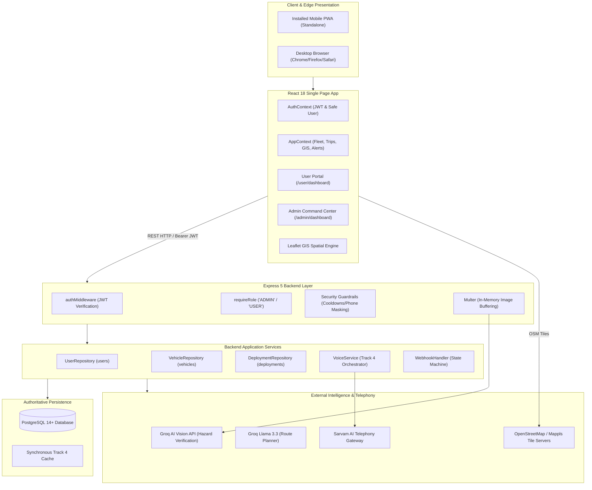

---

## 7. Repository & Directory Structure

```
SIHNER/
├── .env.example                 # Master environment variable template (zero secrets)
├── package.json                 # Project dependencies and unified test scripts
├── vite.config.js               # Vite bundler, PWA manifest, and Workbox caching config
├── index.html                   # Root HTML template with PWA meta & Google Fonts
├── tailwind.config.js           # Tailwind design tokens, typography, and color extensions
├── postcss.config.js            # PostCSS configuration with Tailwind & Autoprefixer
├── DESIGN.md                    # Canonical design system specification
├── README.md                    # Root project summary
│
├── agent/                       # Architectural decisions, acceptance criteria & specs
│   ├── ACCEPTANCE_CRITERIA.md   # Quality, security & test validation standards
│   ├── AGENT_RULES.md           # Engineering guidelines
│   ├── BRAHMAPUTRA_MASTER_SPEC.md # Master system specification
│   ├── DECISIONS.md             # Architectural decision logs (DEC-001 to DEC-006)
│   ├── ISSUES.md                # Issue tracking and resolution ledger
│   └── PROJECT_STATE.md         # Current release milestones
│
├── server/                      # Node.js Express 5 backend
│   ├── index.js                 # Primary server entrypoint, REST routing & static SPA serving
│   ├── auth/                    # Authentication and cryptographic authorization
│   │   ├── authMiddleware.js    # authenticateUser, requireRole, optionalAuth
│   │   └── authUtils.js         # bcrypt hashing, JWT sign/verify, safe user serialization
│   ├── db/                      # PostgreSQL database and repository layer
│   │   ├── db.js                # pg.Pool connection lifecycle & health verification
│   │   ├── index.js             # Consolidated database and repository exports
│   │   ├── schema.js            # DDL scripts, table constraints, NER coordinate resolver
│   │   ├── userRepository.js    # User persistence, email lookup, safe profiles
│   │   ├── vehicleRepository.js # Vehicle persistence, active deployment projection, IDOR guards
│   │   ├── deploymentRepository.js # Journey lifecycle, history tracking, active constraints
│   │   └── cleanupDemoData.js   # Controlled demonstration data cleanup utilities
│   └── voice/                   # Track 4 AI Voice Agent Subsystem
│       ├── agentPrompt.js       # Multilingual system prompts, AI disclosures, guardrails
│       ├── mockVoiceProvider.js # Local development mock voice simulator
│       ├── safetyClassifier.js  # 5-tuple boolean status matrix & deterministic classification
│       ├── securityGuardrails.js# E.164 phone normalization, PII masking, call cooldowns
│       ├── voiceService.js      # Track 4 orchestrator, session ledger, escalation hooks
│       ├── webhookHandler.js    # Telephony state machine, webhook signature verification
│       └── providers/           # Pluggable telephony providers
│           ├── baseProvider.js  # Abstract BaseVoiceProvider contract
│           ├── mockVoiceProvider.js # In-memory provider implementation
│           ├── realVoiceProviderSkeleton.js # Template for telephony backends
│           ├── sarvamVoiceProvider.js # Official Sarvam AI Instant Outbound provider
│           └── voiceProviderFactory.js # Factory selecting active provider via VOICE_PROVIDER
│
├── src/                         # React 18 frontend source code
│   ├── main.jsx                 # Client entrypoint mounting React root
│   ├── App.jsx                  # Root router, intelligent redirects, ProtectedRoute bindings
│   ├── index.css                # Global Tailwind CSS, custom scrollbars, map styles
│   ├── context/                 # Global state management
│   │   ├── AuthContext.jsx      # Authentication state, login, register, logout, session restoration
│   │   └── AppContext.jsx       # Global fleet, deployments, GIS layers, alerts, KPIs
│   ├── services/                # API client layer
│   │   └── api.js               # Unified fetch wrapper with JWT bearer injection
│   ├── utils/                   # Shared frontend utilities
│   │   └── timeFormat.js        # Asia/Kolkata (IST) date, time, and relative timestamp formatter
│   ├── data/                    # Static regional datasets and KPI math
│   │   ├── mockData.js          # Fallback fixtures
│   │   └── nerData.js           # 12 NER Cities, 16 Districts, 8 Corridors, baseline math
│   └── components/              # Component library
│       ├── AlertPanel.jsx       # Disruption alerts feed
│       ├── CommandCenterKPIs.jsx# Admin KPI metric cards with InfoPopover
│       ├── CorridorTelemetryLedger.jsx # Tabbed data ledger (Fleet, Deployments, History)
│       ├── DeployVehicleModal.jsx # Admin deployment dispatch dialog
│       ├── DeploymentDetailsModal.jsx # Deployment inspection & vehicle history dialog
│       ├── DistrictAccessibility.jsx # 16-District accessibility scorecard & filters
│       ├── DriverSafetyModal.jsx# Track 4 voice call trigger and transcript inspector
│       ├── IncidentReportingModal.jsx # Admin multimodal AI incident submission modal
│       ├── MapplsGISMap.jsx     # Leaflet interactive cartography and spatial overlays
│       ├── Navbar.jsx           # Global top navigation bar with live IST clock
│       ├── RoutePlannerModal.jsx# Disruption-aware bypass route planning modal
│       ├── VehicleManager.jsx   # Admin vehicle fleet directory and editor
│       ├── admin/               # Admin portal views
│       │   ├── AdminDashboard.jsx # Command Center layout and tab orchestrator
│       │   └── AdminMobileNav.jsx # Bottom navigation rail for Admin mobile view
│       ├── auth/                # Authentication screens
│       │   ├── AuthBackgroundLandscape.jsx # Visual background terrain graphic
│       │   ├── AuthLoadingScreen.jsx # Startup session restoration splash screen
│       │   ├── LoginPage.jsx    # Sign In screen with eye password toggle
│       │   ├── RegisterPage.jsx # Operator registration screen
│       │   ├── ProtectedRoute.jsx# Auth requirement wrapper
│       │   └── RoleRoute.jsx    # RBAC role requirement wrapper
│       ├── common/              # Shared atomic components
│       │   ├── AppIcons.jsx     # SVG Iconography library
│       │   ├── InfoPopover.jsx  # Contextual technical concept explanation popover
│       │   ├── InstallPromptBanner.jsx # PWA mobile installation prompt
│       │   ├── MobileAppHeader.jsx # Mobile top bar with logo and quick hazard trigger
│       │   ├── NetworkStatusBanner.jsx # Offline connectivity status banner
│       │   ├── QuickActionGrid.jsx # Mobile quick action shortcuts
│       │   └── StatusChip.jsx   # Semantic colored status pills
│       ├── layouts/             # Workspace shell wrappers
│       │   ├── AdminLayout.jsx  # Container for Admin views
│       │   └── UserLayout.jsx   # Container for User views with MobileAppHeader
│       ├── user/                # User / Operator portal views
│       │   ├── UserDashboard.jsx # Operator Command Overview & tab switcher
│       │   ├── UserDeployModal.jsx # Operator vehicle dispatch modal
│       │   ├── UserDeploymentDetailsModal.jsx # Operator journey detail inspector
│       │   ├── UserDeploymentsView.jsx # Tabbed trips view (Ongoing, Upcoming, History)
│       │   ├── UserEditVehicleModal.jsx # Operator vehicle editor
│       │   ├── UserMobileNav.jsx# Bottom navigation rail for Operator mobile view
│       │   ├── UserRegisterVehicleModal.jsx # Operator vehicle enrollment dialog
│       │   ├── UserReportIncidentModal.jsx # Operator hazard submission dialog
│       │   ├── UserRouteIntelligenceView.jsx # Operator route planner & district scorecard
│       │   └── UserVehicleManager.jsx # Operator fleet asset manager
│       └── ProjectBrahmaputra/  # Special visual components
│           ├── BrahmaputraWaterShader.js # WebGL GPU river surface advection shader
│           ├── ProjectBrahmaputraLanding.css # Shader styling
│           └── ProjectBrahmaputraLanding.jsx # Landing splash screen
│
├── public/                      # Static web assets & PWA icons
│   ├── favicon.svg              # SVG vector icon
│   ├── favicon-32x32.png        # Standard 32px favicon
│   ├── favicon-64x64.png        # Standard 64px favicon
│   ├── pwa-192x192.png          # PWA 192px application icon
│   ├── pwa-512x512.png          # PWA 512px application icon
│   ├── maskable-icon-512x512.png# Android adaptive maskable icon
│   ├── apple-touch-icon-180x180.png # iOS home screen icon
│   ├── assets/
│   │   ├── brahmaputra_emblem.png # Official circular crest
│   │   └── brahmaputra_hero.jpg # Satellite terrain visual
│   └── icons/                   # Secondary PWA icon sizes
│
├── test/                        # Automated unit, integration & acceptance test suites
│   ├── api_integration.js
│   ├── auth_security.test.js
│   ├── cross_portal_sync_acceptance.test.js
│   ├── deployment_availability_lifecycle.test.js
│   ├── deployment_repository.test.js
│   ├── district_scorecard_responsive.test.js
│   ├── frontend_deployment_ui.test.js
│   ├── frontend_hydration.test.js
│   ├── frontend_routing_auth_ui.test.js
│   ├── gis_ownership_incident_origin_acceptance.test.js
│   ├── intelligence_incidents_track4_acceptance.test.js
│   ├── issue1_user_vehicle_ownership_isolation.test.js
│   ├── issue2_deployment_based_active_vehicle_visibility.test.js
│   ├── issue3_route_origin_destination_persistence.test.js
│   ├── issue4_demo_data_removal_and_empty_state.test.js
│   ├── issue4c_controlled_demo_cleanup.test.js
│   ├── issue5_real_data_e2e_acceptance.test.js
│   ├── mobile_top_navigation.test.js
│   ├── ownership_access_control.test.js
│   ├── password_visibility_toggle.test.js
│   ├── phase2c_post_call_intelligence.test.js
│   ├── phase3a_acceptance.test.js
│   ├── phase3b_acceptance.test.js
│   ├── phase3i_full_system_acceptance.test.js
│   ├── phase8_production_hardening.test.js
│   ├── pwa_manifest_mobile.test.js
│   ├── real_device_pwa_acceptance.test.js
│   ├── sarvam_voice_provider.test.js
│   ├── track4_acceptance.js
│   ├── track4_persistent_vehicle.test.js
│   ├── user_portal_acceptance.test.js
│   ├── vehicle_driver_phone_update.test.js
│   ├── vehicle_registration_acceptance.test.js
│   ├── vehicle_repository.test.js
│   ├── voice_provider_abstraction.test.js
│   └── webhook_state_machine.test.js
│
└── backend/                     # Auxiliary Python data ingestion pipeline & web scrapers
    ├── requirements.txt         # Python dependencies (httpx, BeautifulSoup4, redis, rq)
    ├── srapper.md               # Scraper execution guide
    └── app/                     # Python ETL ingestion modules (GDELT, IMD, PIB scrapers)
```

---

## 8. User Roles & RBAC Architecture

Project Brahmaputra implements strict **Role-Based Access Control (RBAC)** across frontend routes and backend REST controllers.

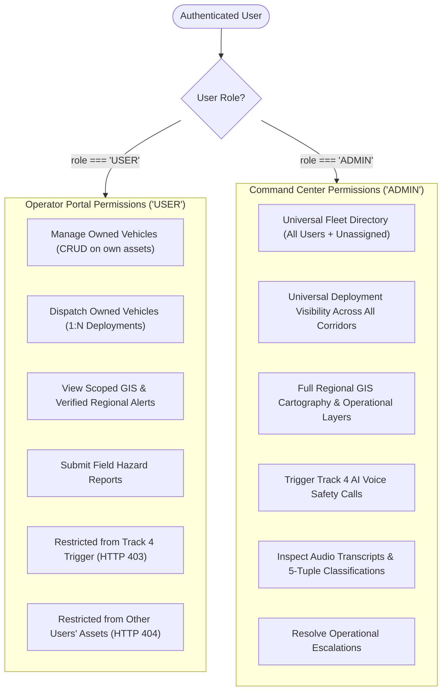

### Role Capabilities & Scope Comparison
| Feature / Domain | Operator (`USER`) Scope | Command Center (`ADMIN`) Scope |
| :--- | :--- | :--- |
| **Accessible Portal Route** | `/user/dashboard` | `/admin/dashboard` |
| **Fleet Visibility** | Strictly own registered vehicles (`owner_user_id === user.id`) | Universal (all user-owned assets + legacy admin vehicles) |
| **Vehicle Registration** | Enrolled under own user account | Enrolled as admin-managed or assigned to user |
| **Journey Dispatch** | Can deploy only owned available vehicles | Can deploy any available vehicle in registry |
| **Journey Management** | Can complete/cancel only own journeys | Can complete/cancel any journey across all corridors |
| **GIS Operations Map** | Scoped vehicle markers (own fleet) + verified alerts | Universal vehicle markers + all field reports + disruptions |
| **Incident Reports** | Verified regional alerts + own unverified reports | All reports (verified + unverified) with AI verification metadata |
| **Track 4 Voice Agent Triggers** | **Forbidden** (`HTTP 403 Forbidden`) | **Full Access**: Flag vehicles, trigger live/simulated calls |
| **Escalation Resolution** | Read-only alert viewing | Resolve call escalations and record supervisory notes |

---

## 9. Authentication & Session Management

### 1. End-to-End Authentication Architecture
- **Password Security**: Passwords are validated for a minimum length of 8 characters and hashed using `bcryptjs` with an adaptive 10-round salt factor (`hashPassword` in `server/auth/authUtils.js`). Plaintext passwords and hashes are never returned in responses or logged.
- **JWT Issuance**: On successful verification (`/api/auth/login` or `/api/auth/register`), the server generates a signed JSON Web Token using HMAC-SHA256 (`getJwtSecret()`), embedding `{ userId, email, role }` with a 24-hour expiration (`expiresIn: '24h'`).
- **Token Transmission & Storage**: The frontend stores the token in browser `localStorage` under `ner_auth_token`. The `api.js` client automatically injects the `Authorization: Bearer <token>` header on every subsequent request.
- **Session Restoration**: When the application loads, `AuthContext.jsx` initiates `restoreSession()`, issuing a `GET /api/auth/me` request. The backend middleware `authenticateUser` validates the token against the secret, fetches the active user from `userRepository`, and returns a sanitized user profile (`toSafeUser`). If the token is invalid or expired, `localStorage` is cleared and the state transitions to unauthenticated.
- **Eye Password Toggle**: Both `LoginPage.jsx` and `RegisterPage.jsx` feature an interactive, accessible password visibility toggle (`IconEye` / `IconEyeOff`), allowing users to verify typed credentials without exposing passwords to screen scraping.

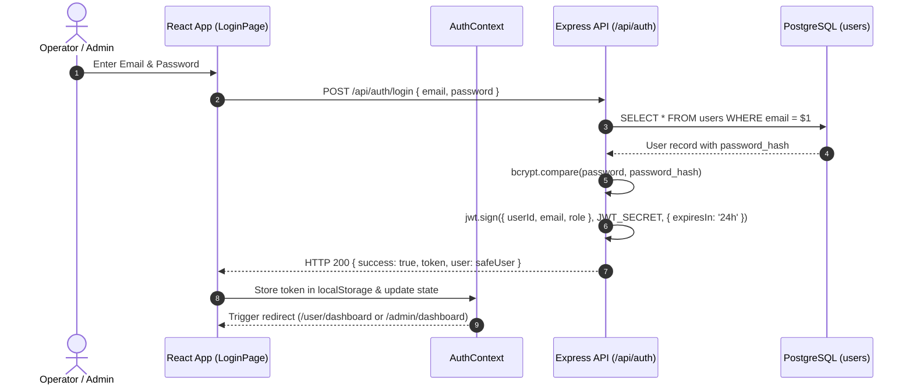

---

## 10. Resource Ownership, Multi-Tenancy & Anti-IDOR Protections

Project Brahmaputra implements strict tenant isolation to prevent **Insecure Direct Object Reference (IDOR)** vulnerabilities.

### Anti-IDOR Enforcement Rules
1. **Server-Side Identity Derivation**: When a `USER` registers a vehicle or dispatches a journey, the backend discards any `ownerUserId` submitted in the request payload and strictly assigns `req.user.id` extracted from the cryptographically verified JWT token.
2. **Anti-Enumeration 404 Responses**: If User A attempts to read (`GET /api/vehicles/:id`), update (`PUT /api/vehicles/:id`), delete (`DELETE /api/vehicles/:id`), or deploy a vehicle belonging to User B, the server responds with **`HTTP 404 Not Found`** rather than `HTTP 403 Forbidden`. This prevents malicious actors from enumerating valid IDs across other tenants.
3. **Inherited Deployment Ownership**: Deployments do not maintain a separate mutable user FK. Instead, deployment ownership is derived strictly by joining against the underlying vehicle (`deployments.vehicle_id` $\rightarrow$ `vehicles.owner_user_id`).
4. **Relational Deletion Guards**: A vehicle cannot be deleted if it has an active deployment (`ACTIVE`, `DELAYED`, `PLANNED`) or an ongoing Track 4 safety call (`PENDING_CALL`). Deleting a vehicle with historical completed deployments is rejected to preserve regulatory audit trails.

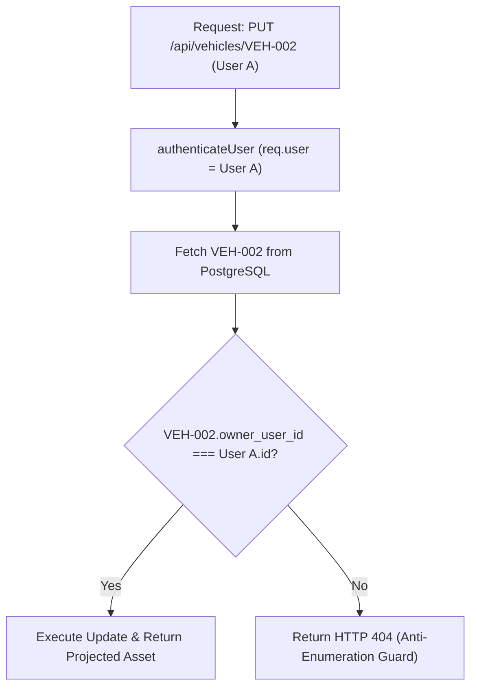

---

## 11. User / Operator Portal Walkthrough

The **User Portal** (`/user/dashboard`) is the dedicated operational interface for transport operators, fleet managers, and relief drivers.

```
┌────────────────────────────────────────────────────────────────────────┐
│ MOBILE HEADER: Project Brahmaputra | [Report Hazard] | [Logout]        │
├────────────────────────────────────────────────────────────────────────┤
│ OPERATOR CONSOLE: Assam Regional Fleet (Connected)                     │
│ [ Dispatch Journey ]   [ Register Vehicle ]   [ Report Road Hazard ]   │
├────────────────────────────────────────────────────────────────────────┤
│ TABS: [1. Overview]   [2. GIS Map]   [3. Deployments]   [4. Fleet]     │
├────────────────────────────────────────────────────────────────────────┤
│ 2x2 KPI GRID:                                                          │
│ ┌──────────────────────┬──────────────────────┐                        │
│ │ Registered Fleet: 8  │ Active Journeys: 3   │                        │
│ ├──────────────────────┼──────────────────────┤                        │
│ │ Available Units: 5   │ Active Hazards: 2    │                        │
│ └──────────────────────┴──────────────────────┘                        │
├────────────────────────────────────────────────────────────────────────┤
│ IN-TRANSIT JOURNEY CARDS:                                              │
│ • AS-01-GC-4482: Guwahati -> Silchar (NH-6) | Cargo: Medical Supplies  │
│ • ML-05-E-9012: Guwahati -> Shillong (GS Road) | Cargo: Food Rations   │
├────────────────────────────────────────────────────────────────────────┤
│ BOTTOM NAV (Mobile): [Home] [Map] [Trips (3)] [Vehicles (8)] [More]    │
└────────────────────────────────────────────────────────────────────────┘
```

### Operator Navigation Screens
1. **Screen 1: Command Overview (`HOME`)**:
   - **Critical Disruption Banner**: Displays urgent corridor alerts (e.g. NH-6 Sonapur Tunnel blockage).
   - **Number-First 2×2 KPI Grid**: Registered Fleet, Active Journeys, Available Units, Active Disruptions with contextual `InfoPopover` tooltips.
   - **Corridor Safety Status Bar**: Displays calculated regional safety rating (Nominal, Elevated Caution, Critical Risk).
   - **Quick Action Grid**: One-tap dispatch, vehicle registration, map navigation, hazard reporting.
   - **Active Journey Summary**: Cards showing in-transit movements with quick "Report Issue" action.
2. **Screen 2: GIS Operations Map (`MAP`)**:
   - Full-height interactive Leaflet GIS map displaying open corridors, blocked segments, weather alerts, and user-owned vehicle markers.
   - Tactical "Plan Route" button launching the AI route planner.
3. **Screen 3: Deployments & Trips (`DEPLOYMENTS`)**:
   - Tabbed view: **Ongoing** (Active/Delayed trips), **Upcoming** (Planned), **History** (Completed/Cancelled).
   - Direct controls to complete or cancel active journeys.
4. **Screen 4: Fleet Assets (`VEHICLES`)**:
   - List of all operator-owned vehicles with registration numbers, payload capacity, driver contact details, and current status.
   - Direct "Deploy" trigger for available units.
5. **Screen 5: Alerts & Profile (`MORE`)**:
   - Operator credentials, organization details, system datums (IST / WGS-84), active regional disruption advisories, and authenticated session sign-out.

---

## 12. Mobile Application & PWA Experience

Project Brahmaputra is engineered as a mobile-first Progressive Web App designed to perform reliably on touch devices in remote North Eastern mountain corridors.

### Key Mobile Architectural Features
- **Mobile App Header (`MobileAppHeader.jsx`)**: Displays official Brahmaputra emblem, operator title, top-level "Report Hazard" trigger, and secure sign-out.
- **Persistent Bottom Navigation (`UserMobileNav.jsx` / `AdminMobileNav.jsx`)**: 5-tab persistent bottom bar (`Home`, `Map`, `Trips`, `Vehicles`, `More`) with active badge counters and 48px minimum touch targets (`touch-target`).
- **PWA Back-Button Hierarchy**: Intercepts hardware and browser back buttons via `popstate` event listeners. When a modal or sub-screen is active, pressing Back dismisses the modal or returns to `HOME` before exiting the application.
- **Scroll Locking**: When modals or bottom sheets are open, background scrolling is locked on `document.body` while preserving the exact vertical scroll offset.
- **Safe-Area Insets**: Respects mobile display cutouts and navigation home bars (`viewport-fit=cover`, `env(safe-area-inset-bottom)`).

---

## 13. Vehicle Registration Architecture & Validation

When a user or admin registers a new vehicle (`POST /api/vehicles`), the server executes comprehensive validation:

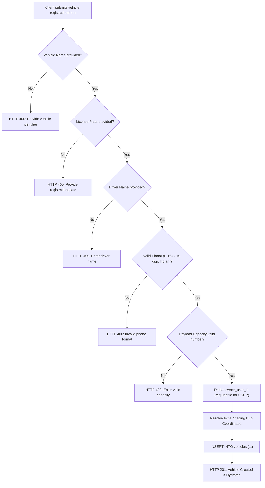

### Registration Parameters & Normalization
| Parameter | Type | Validation & Normalization Rules |
| :--- | :--- | :--- |
| `name` / `vehicleName` | String | Trimmed, non-empty. E.g. `Assam Pharma-Logistics MedTruck 01`. |
| `licensePlate` / `regNumber`| String | Trimmed, converted to uppercase. Checked against unique index `LOWER(reg_number)`. |
| `type` / `category` | String | Vehicle classification: `Refrigerated Medical Van`, `Heavy Cargo Truck`, `Container Freight Truck`, `POL Tanker`, `LCV`. |
| `capacity` / `cargoCapacityKg`| String/Number| Normalized to integer kilograms (e.g. "3.5 Ton" $\rightarrow$ `3500` kg). Must be $>0$ and $\le 100,000$ kg. |
| `driverName` | String | Trimmed primary driver name. |
| `driverPhone` | String | Validated and normalized into E.164 standard (`+91XXXXXXXXXX`) via `validateAndNormalizePhone()`. |
| `origin` / `stagingHub` | String | Known NER Hub (e.g. `Guwahati`, `Silchar`, `Shillong`). Maps to geodetic GPS coordinates via `resolveLocationCoordinates()`. |
| `ownerUserId` | String | Set automatically to authenticated user's ID (`req.user.id`). Client input ignored for `USER` role. |

---

## 14. Vehicle Fleet Management & Directory

The fleet directory provides multi-dimensional searching, filtering, and status tracking across all registered units.

```mermaid
graph LR
    subgraph Filters ["Fleet Directory Filters"]
        F1["All Vehicles"]
        F2["Available at Depot"]
        F3["Currently Deployed"]
        F4["In Transit"]
        F5["Delayed"]
        F6["Emergency Critical"]
        F7["Safety Flagged"]
    end

    subgraph Actions ["Operational Actions"]
        A1["Dispatch Journey (Available only)"]
        A2["Edit Driver / Phone"]
        A3["Trigger Track 4 Safety Call (Admin)"]
        A4["Inspect Journey History"]
        A5["Decommission Vehicle (Guarded)"]
    end

    Filters --> Actions
```

### Fleet Status Attributes
- **Asset Registration & Identity**: Permanent ID (`VEH-NER-101`), registration plate (`AS-01-GC-4482`), vehicle name.
- **Cargo Specification**: Category, tonnage capacity, current cargo manifest (`Vaccines, Blood Plasma & Insulin`).
- **Assigned Driver**: Driver name, E.164 telephone number (masked for public view: `+91-98640-XXXXX`).
- **Operational Status**: `AVAILABLE`, `IN_TRANSIT`, `DELAYED`, `REROUTED`, `IDLE_STAGING`.
- **Safety Status**: `NOT_CHECKED`, `PENDING_CALL`, `SAFE`, `DELAYED`, `BREAKDOWN`, `ROAD_BLOCKED`, `ASSISTANCE_REQUIRED`, `NO_RESPONSE`, `UNKNOWN`.

---

## 15. Vehicle Lifecycle & State Machine

A vehicle operates as a **persistent physical asset** that cycles between availability and active deployment missions.

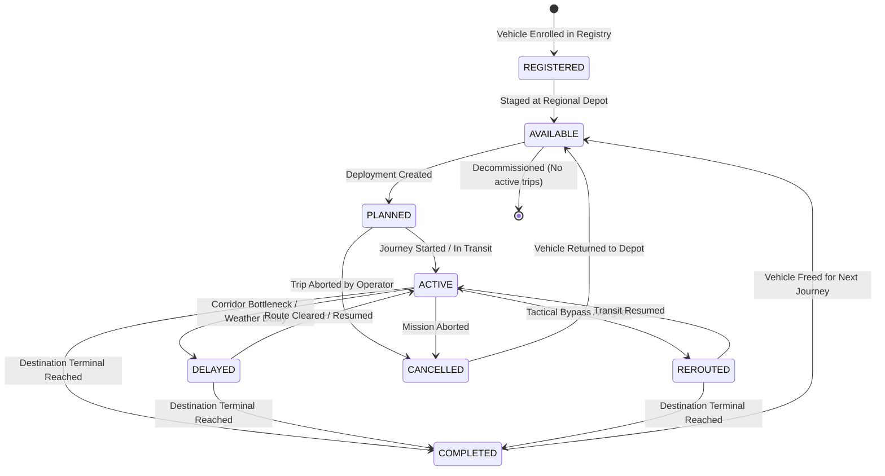

---

## 16. Deployment & Journey Management (1:N Asset-to-Trip Model)

Project Brahmaputra enforces an explicit **1:N relational architecture** separating permanent physical vehicles from transient journey deployments.

```
┌─────────────────────────────────────────────────────────────┐
│                    PHYSICAL VEHICLE (1)                     │
│  ID: VEH-NER-101 | Plate: AS-01-GC-4482 | Driver: B. Kalita │
└──────────────────────────────┬──────────────────────────────┘
                               │
            ┌──────────────────┴──────────────────┐
            ▼                                     ▼
┌─────────────────────────────┐       ┌─────────────────────────────┐
│    DEPLOYMENT 1 (HISTORIC)  │       │     DEPLOYMENT 2 (ACTIVE)   │
│  ID: DEP-NER-090            │       │  ID: DEP-NER-101            │
│  Origin: Guwahati           │       │  Origin: Guwahati           │
│  Destination: Tezpur        │       │  Destination: Silchar       │
│  Status: COMPLETED          │       │  Status: ACTIVE             │
│  Completed: 2026-09-18      │       │  Started: 2026-09-21        │
└─────────────────────────────┘       └─────────────────────────────┘
```

### Deployment Workflow
1. **Selection**: Operator selects an owned vehicle in `AVAILABLE` status.
2. **Dispatch Parameters**: Defines Origin Hub, Destination Terminal, Assigned Corridor (e.g. `NH-6`), Cargo Manifest, Mission Priority (`LOW`, `MEDIUM`, `HIGH`, `EMERGENCY_CRITICAL`), and Dispatch Notes.
3. **Dispatch Execution (`POST /api/deployments`)**:
   - Backend verifies vehicle exists, is owned by user, and has **zero active deployments**.
   - Creates new record in `deployments` table with status `ACTIVE`.
   - Projects active deployment state onto vehicle (`hasActiveDeployment: true`).
4. **Lifecycle Execution**:
   - Journey can be completed (`POST /api/deployments/:id/complete`) $\rightarrow$ sets `completed_at`, status `COMPLETED`, returns vehicle to `AVAILABLE`.
   - Journey can be cancelled (`POST /api/deployments/:id/cancel`) $\rightarrow$ sets status `CANCELLED`, returns vehicle to `AVAILABLE`.
   - Full journey history is preserved in PostgreSQL for auditing.

---

## 17. Vehicle Availability & Dispatch Rules

A vehicle is strictly classified as **Available** when all of the following conditions are met:
1. **Ownership Match**: Owned by the authenticated operator (`owner_user_id === req.user.id`).
2. **Zero Active Deployments**: Has no associated deployment with status `PLANNED`, `ACTIVE`, or `DELAYED`.
3. **Not Blocked by Active Telephony Audit**: Safety status is not `PENDING_CALL`.

### Zero Available Vehicles UI State
When an operator has enrolled vehicles but all units are currently in transit, the UI:
- Disables the "Dispatch Journey" action button with informative helper text (`0 ready at depot`).
- Displays an empty available state encouraging the operator to either register a new fleet asset or complete an ongoing journey.

---

## 18. Route Coordinates, Geodetic Tagging & Fallback Prevention

The platform maintains an authoritative coordinate dictionary of strategic North Eastern gateways in `server/db/schema.js` (`NER_HUB_LOCATIONS`):

```javascript
export const NER_HUB_LOCATIONS = {
  Guwahati:    { lat: 26.1445, lng: 91.7362 },
  Shillong:    { lat: 25.5788, lng: 91.8933 },
  Silchar:     { lat: 24.8170, lng: 92.7960 },
  Dimapur:     { lat: 25.9068, lng: 93.7273 },
  Imphal:      { lat: 24.8170, lng: 93.9368 },
  Itanagar:    { lat: 27.0844, lng: 93.6053 },
  Aizawl:      { lat: 23.7271, lng: 92.7176 },
  Agartala:    { lat: 23.8315, lng: 91.2868 },
  Gangtok:     { lat: 27.3389, lng: 88.6065 },
  Kohima:      { lat: 25.6751, lng: 94.1086 },
  Tezpur:      { lat: 26.6338, lng: 92.7926 },
  Jorhat:      { lat: 26.7509, lng: 94.2037 },
  Haflong:     { lat: 25.1667, lng: 93.0167 },
  Nagaon:      { lat: 26.3450, lng: 92.6840 },
  Dibrugarh:   { lat: 27.4728, lng: 94.9120 },
  Siliguri:    { lat: 26.7271, lng: 88.3953 },
  Sonapur:     { lat: 26.1167, lng: 91.9833 },
  Jiribam:     { lat: 24.8021, lng: 93.1235 },
  Tura:        { lat: 25.5144, lng: 90.2033 },
  Bongaigaon:  { lat: 26.5028, lng: 90.5528 },
};
```

### Fallback Prevention Guarantee
The coordinate resolver `resolveLocationCoordinates(name)` strictly returns `{ lat, lng }` if a case-insensitive match exists, or `null` if unresolvable. **It never silently substitutes an arbitrary geographic default (e.g. Guwahati)**, ensuring corrupted or unknown locations are not misrepresented on GIS cartography.

---

## 19. Vehicle Position Resolution Hierarchy

When displaying a vehicle on the GIS Map, the system determines its coordinates using a strict 4-tier hierarchy implemented in `vehicleRepository.projectActiveDeployment`:

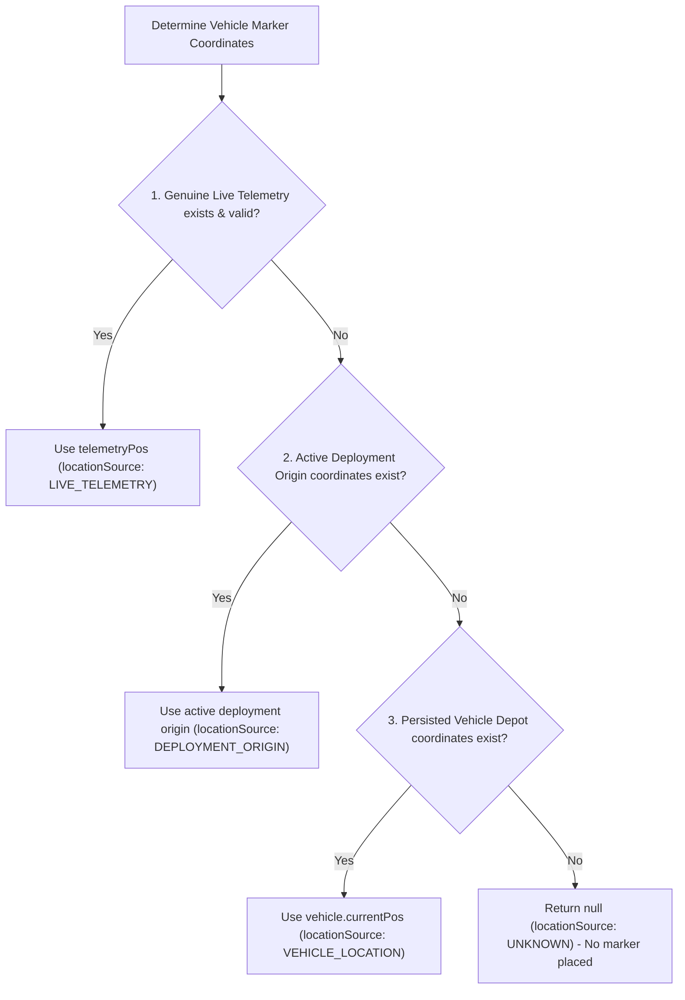

---

## 20. GIS Architecture, Layers & Spatial Engine

The spatial cartography engine in `src/components/MapplsGISMap.jsx` uses **Leaflet 1.9.4** to render clean, high-performance geospatial layers.

```
┌────────────────────────────────────────────────────────────────────────┐
│ GIS CONTROL: [Route] [Disruptions (3)] [Fleet (8)] [Weather] [Refresh] │
├────────────────────────────────────────────────────────────────────────┤
│ MAP CANVAS (Leaflet / OpenStreetMap Tiles / WGS-84):                   │
│                                                                        │
│       (Gangtok)                       (Itanagar)                       │
│           \                               /                            │
│         (Siliguri)------(Guwahati)======(Tezpur)                       │
│                             ||              \                          │
│                         (Shillong)        (Dimapur)                    │
│                             ||                \                        │
│                     [! SONAPUR BLOCKED !]   (Kohima)                   │
│                             ||                  \                      │
│                          (Silchar)============(Imphal)                 │
│                           /     \                                      │
│                      (Aizawl)  (Agartala)                              │
│                                                                        │
├────────────────────────────────────────────────────────────────────────┤
│ FLOATING HUD: Tactical Bypass (Guwahati -> Nagaon -> Haflong -> Silchar│
├────────────────────────────────────────────────────────────────────────┤
│ LEGEND: [● Disruption] [■ Fleet] [== Open Highway] [-- Blocked Corridor]│
└────────────────────────────────────────────────────────────────────────┘
```

### Managed Cartographic Layers
1. **Highway Corridors Layer (`corridorsLayerRef`)**: Renders arterial highway routes with color-coded status (`OPEN` = Slate `#334155`, `CAUTION` = Amber `#D97706`, `DISRUPTED` = Dashed Rose `#E11D48`).
2. **Regional Logistics Hubs Layer (`hubsLayerRef`)**: Circular markers with permanent labels for key logistics hubs across all 8 states.
3. **Incident & Disruption Markers Layer (`incidentsLayerRef`)**: Pulsing red badges indicating verified landslides, waterlogging, and bridge restrictions.
4. **Fleet Telemetry Markers Layer (`vehiclesLayerRef`)**: Vehicle markers reflecting operational status and safety flags.
5. **Corridor Weather Layer (`weatherLayerRef`)**: Precipitation badges displaying rainfall in mm and atmospheric visibility.
6. **Active Projected Route Layer (`routeLayerRef`)**: Glowing blue polyline overlay representing calculated tactical detour paths.

---

## 21. User vs. Admin GIS Data Scoping

Server-side scoping strictly filters GIS spatial data based on authenticated role:

| Spatial Entity | Operator Portal (`USER`) Visibility | Command Center (`ADMIN`) Visibility | Server Filtering Location |
| :--- | :--- | :--- | :--- |
| **Fleet Vehicle Markers** | **Owned vehicles only** | **All regional vehicles** | `server/index.js` (`GET /api/vehicles`) |
| **Incident Markers** | Verified regional alerts + Own unverified reports | All reports (Verified + Unverified) | `server/index.js` (`GET /api/incidents`) |
| **Highway Corridors** | All arterial corridors (Public regional data) | All arterial corridors | `src/data/nerData.js` |
| **Weather Telemetry** | All monitored corridor weather feeds | All monitored corridor weather feeds | `server/index.js` (`GET /api/weather`) |

---

## 22. Map Camera vs. Vehicle Location Semantics

The system strictly differentiates between:
- **Default Map Camera Center**: Fixed geodetic viewpoint centered on Northeast India (`[25.85°N, 92.70°E]`, Zoom level `7`). Used solely for initializing the Leaflet viewport to encompass all 8 NE states.
- **Actual Vehicle Position**: Resolved geodetic coordinates derived from live telemetry or active deployment origins.
- **Strict Invariant**: The camera center is never used as a geographic fallback for vehicles with unknown locations. Vehicles lacking valid coordinates are omitted from the map canvas.

---

## 23. Incident & Hazard Reporting Subsystem

Field operators and administrators can submit road disruption reports through dedicated modal dialogs (`UserReportIncidentModal.jsx` and `IncidentReportingModal.jsx`).

### Implemented Incident Categories
- `LANDSLIDE`: Hillside slope failure, boulder falls, mud deposits.
- `FLOOD` / `WATERLOGGING`: Embankment breach, standing sheet water across carriageway.
- `BRIDGE_DAMAGE` / `STRUCTURAL_SUBSIDENCE`: Pier scour, deck cracks, bridge weight restrictions.
- `ROAD_DAMAGE` / `CAVEOUT`: Surface erosion, pavement collapse, washed-out culverts.
- `OBSTRUCTION` / `ACCIDENT`: Overturned vehicles, checkpoint bottlenecks.

---

## 24. Multimodal AI Vision Verification (Groq / Qwen / Llama)

To prevent false alarms and unverified roadblock broadcasts, `POST /api/incidents/verify` integrates with **Groq AI Vision** (`qwen/qwen3.8-27b`).

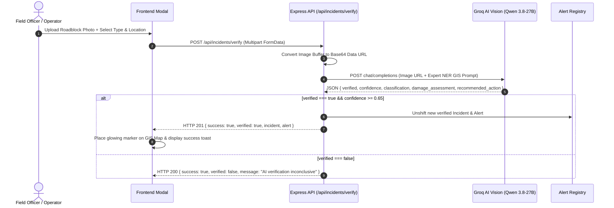

---

## 25. Disruption Intelligence & Corridor Analysis

The system tracks real-time disruption telemetry across major North Eastern highways:

```
┌────────────────────────────────────────────────────────────────────────┐
│ ACTIVE CORRIDOR DISRUPTION INTELLIGENCE (LIVE REGIONAL TELEMETRY)      │
├────────────────────────────────────────────────────────────────────────┤
│ 1. NH-6 (Guwahati - Shillong - Silchar Corridor)                       │
│    • Bottleneck: Sonapur Tunnel (East Jaintia Hills, Meghalaya)        │
│    • Disruption: CRITICAL Landslide (150m buried under 3.5m mud/rock)  │
│    • Status: Complete Carriageway Blockage (6.5h Clearance Est.)       │
│    • Advisory: Reroute high-priority convoys via Haflong (NH-27/627)   │
├────────────────────────────────────────────────────────────────────────┤
│ 2. NH-27 (Guwahati - Nagaon - Dimapur East-West Corridor)              │
│    • Bottleneck: Raha Flood Plain (Nagaon, Assam)                      │
│    • Disruption: HIGH Inundation (45cm standing Kopili river water)    │
│    • Status: Slow Single-Lane Transit (30-45 min delay)                │
│    • Advisory: Heavy freight (>10T) and relief convoys only            │
├────────────────────────────────────────────────────────────────────────┤
│ 3. NH-37 (Silchar - Jiribam - Imphal Lifeline)                         │
│    • Bottleneck: Jiribam Barak River Bridge (Manipur Border)           │
│    • Disruption: CRITICAL Pier Scour & Transverse Deck Slab Crack      │
│    • Status: Weight Limit <5 Tons Enforced                             │
│    • Advisory: Transship cargo into Light Commercial Vehicles (LCVs)   │
└────────────────────────────────────────────────────────────────────────┘
```

---

## 26. Alerting & Emergency Broadcast System

Alerts (`/api/alerts`) broadcast actionable warnings to operators and command center staff:
- **Severity Levels**: `CRITICAL` (Red `#DC2626`), `WARNING` (Amber `#D97706`), `CAUTION` (Blue `#2563EB`).
- **Incident Linkage**: Each alert references a parent `incidentId`, headline, affected district, operational impact, recommended advisory, and active timestamp.
- **Badge Indicators**: Unread/active alert counts update dynamically on navbar icons and mobile bottom navigation tabs.

---

## 27. Regional Accessibility Scorecard & Vulnerability Index

The **Regional Accessibility Scorecard** (`src/components/DistrictAccessibility.jsx`) evaluates district road transit feasibility across 16 monitored districts.

```
┌────────────────────────────────────────────────────────────────────────┐
│ REGIONAL ACCESSIBILITY SCORECARD: District Road Accessibility Status   │
├────────────────────────────────────────────────────────────────────────┤
│ SUMMARY: Avg Accessibility: 78.5% | 10 Accessible | 3 Watch | 3 Restr. │
├────────────────────────────────────────────────────────────────────────┤
│ STATE FILTER: [ ALL ] [ Assam ] [ Meghalaya ] [ Manipur ] [ Mizoram ]  │
├────────────────────────────────────────────────────────────────────────┤
│ DISTRICT DATA (Desktop Table / Mobile Cards):                          │
│ • Kamrup Metro (Assam): 94% [ACCESSIBLE] | Vuln: 0.18 | ID: DIST-01    │
│ • East Khasi Hills (Meghalaya): 88% [ACCESSIBLE] | Vuln: 0.32          │
│ • Cachar / Barak Valley (Assam): 62% [RESTRICTED] | Vuln: 0.76         │
│ • Imphal West (Manipur): 58% [RESTRICTED] | Vuln: 0.81                 │
│ • West Jaintia Hills (Meghalaya): 60% [RESTRICTED] | Vuln: 0.74        │
│ • Aizawl (Mizoram): 74% [WATCH] | Vuln: 0.52                          │
└────────────────────────────────────────────────────────────────────────┘
```

### Classification Tiers
- **Accessible ($\ge 85\%$)**: Green badge (`bg-emerald-50 text-emerald-700`). Corridors fully open with nominal transit speeds.
- **Watch ($70\% - 84\%$)**: Amber badge (`bg-amber-50 text-amber-700`). Minor weather slowdowns or single-lane convoy escorts.
- **Restricted ($< 70\%$)**: Rose badge (`bg-rose-50 text-rose-700`). Severe carriage disruption, active landslides, or bridge load limits.

---

## 28. Accessibility Scorecard Mobile & Responsive Architecture

To maintain readability across screen sizes, the scorecard uses dual presentation modes:
- **Desktop ($\ge 1024\text{px}$)**: 6-column analytical table displaying District Name, State, Progress Bar, Status Tier, Vulnerability Index, and District ID.
- **Mobile ($< 1024\text{px}$)**: Stacked operational district cards with horizontal state filter rail, touch-friendly search, and zero-overflow wrapping.

---

## 29. Disruption-Aware Route Planning & Bypass Intelligence

The route planning engine (`POST /api/routes/plan`) calculates optimal detour routes avoiding active corridor hazards.

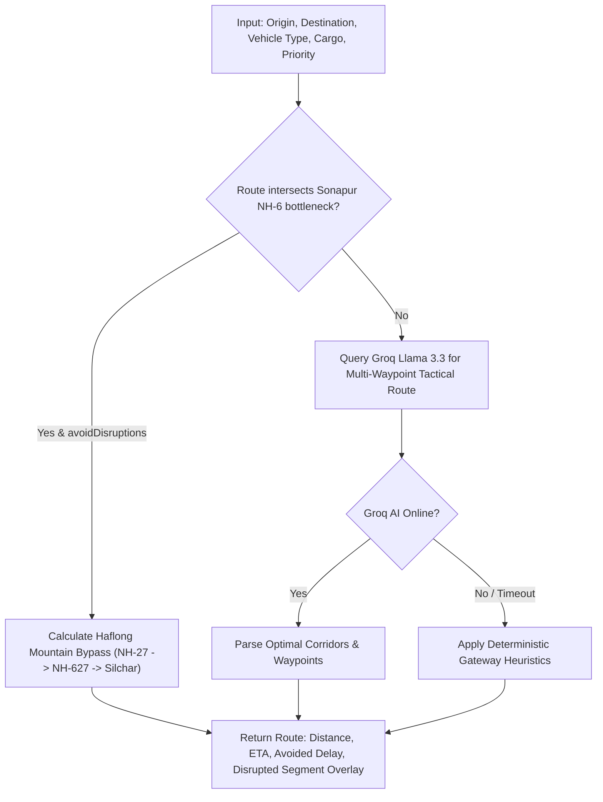

### Example: Sonapur Tunnel Landslide Bypass
- **Direct Route (Blocked)**: Guwahati $\rightarrow$ Shillong $\rightarrow$ Sonapur Tunnel (NH-6) $\rightarrow$ Silchar (Distance: 215 km, Delay: +180 to 240 mins).
- **Tactical Bypass (Calculated)**: Guwahati $\rightarrow$ Nagaon (NH-27) $\rightarrow$ Haflong Mountain Staging (NH-627) $\rightarrow$ Silchar Distribution Depot (Distance: 342 km, ETA: 6.8h, **Delay Avoided: 240 mins**).

---

## 30. Corridor Weather Telemetry Subsystem

The weather engine (`/api/weather`) aggregates real-time meteorological conditions along mountain transit corridors:
- **Monitored Metrics**: Rainfall volume in millimeters (`rainfallMm`), atmospheric alert level (`GREEN`, `YELLOW`, `AMBER`, `RED`), surface condition (`Torrential Rain & Monsoon Downpour`, `Dense Mountain Fog & Mist`), and wind speed (`windKmH`).
- **GIS Integration**: Weather markers are mapped to corridor midpoints with rainfall badges and landslide risk assessments.

---

## 31. Dashboard KPIs & Analytical Aggregation

The system computes real-time operational KPIs dynamically from database state and active telemetry:

```
┌────────────────────────────────────────────────────────────────────────┐
│                        COMMAND CENTER KPI MATRIX                       │
├───────────────────┬───────────────────┬───────────────────┬────────────┤
│ Regional          │ Districts         │ Active            │ Vehicles   │
│ Accessibility     │ Monitored         │ Disruptions       │ in Transit │
│     78.5%         │        16         │         3         │     3      │
│  (10 Accessible)  │   (8 NE States)   │ (2 Critical NH-6) │ (On Route) │
└───────────────────┴───────────────────┴───────────────────┴────────────┘
```

| KPI Metric | Calculation Source | Refresh Trigger |
| :--- | :--- | :--- |
| **District Accessibility** | Average accessibility score across all 16 districts | Dynamic recalculation on district update |
| **Districts Monitored** | Total tracked district clusters | Static registry count (16) |
| **Active Disruptions** | Count of verified incidents with severity `CRITICAL` or `HIGH` | Real-time incident addition/resolution |
| **Vehicles in Transit** | Count of vehicles with active deployments (`ACTIVE`/`DELAYED`/`PLANNED`) | Real-time journey lifecycle transition |
| **Average Corridor Delay** | Mean delay minutes across all arterial corridors | Real-time corridor telemetry updates |

---

## 32. Contextual Information Popover System (`(i)`)

To eliminate ambiguity regarding technical metrics, `src/components/common/InfoPopover.jsx` provides an accessible, non-intrusive tooltip and bottom-sheet explanation system:
- **Desktop View**: Hovering over the `(i)` icon displays an elevated dark tooltip (`bg-slate-900`) with concept title and detailed operational explanation.
- **Mobile View**: Tapping the `(i)` icon presents an animated modal bottom sheet with background scroll locking.
- **Keyboard Accessibility**: Fully operable via `Enter`, `Space`, and `Escape` keys with complete ARIA attributes (`aria-haspopup="dialog"`, `aria-expanded`).

---

## 33. Admin Command Center Walkthrough

The **Admin Command Center** (`/admin/dashboard`) provides supervisory visibility across all logistics operations in the North East:

```
┌────────────────────────────────────────────────────────────────────────┐
│ NAVBAR: Project Brahmaputra | [Report Hazard] [Add Vehicle] [Route AI] │
├────────────────────────────────────────────────────────────────────────┤
│ COMMAND CENTER: Universal Fleet & Regional Intelligence Hub            │
│ 4-COL KPI MATRIX: [Accessibility: 78%] [Districts: 16] [Alerts: 3]     │
├────────────────────────────────────────────────────────────────────────┤
│ TABS: [1. Overview]   [2. GIS Map]   [3. Fleet Directory]   [4. Alerts]│
├────────────────────────────────────────────────────────────────────────┤
│ ACTIVE VIEW (Overview):                                                │
│ ┌───────────────────────────────────┬────────────────────────────────┐ │
│ │ LEAFLET GIS MAP (Live Telemetry) │ REGIONAL ACCESSIBILITY CARD    │ │
│ │ • Corridors & Roadblocks          │ • 16 Districts & Scorecards    │ │
│ └───────────────────────────────────┴────────────────────────────────┘ │
│ ┌────────────────────────────────────────────────────────────────────┐ │
│ │ CORRIDOR TELEMETRY LEDGER:                                         │ │
│ │ [Fleet Assets (8)] [Active Deployments (3)] [Trip History]         │ │
│ └────────────────────────────────────────────────────────────────────┘ │
└────────────────────────────────────────────────────────────────────────┘
```

### Administrative Tabs
1. **Overview (`OVERVIEW`)**: Full operational dashboard with KPIs, Leaflet GIS map, district accessibility scorecard, and tabbed telemetry ledger.
2. **GIS Operations Map (`MAP`)**: Full-screen spatial cartography with layer toggles and route projection HUD.
3. **Fleet Directory (`FLEET`)**: Universal vehicle directory displaying all user-owned and admin-managed units with Track 4 safety audit triggers.
4. **Disruption Alerts (`ALERTS`)**: Master emergency advisory feed with bypass calculation shortcuts.

---

## 34. Fleet Directory & Multi-Filtering Subsystem

The fleet directory (`src/components/VehicleManager.jsx` & `src/components/CorridorTelemetryLedger.jsx`) provides filtering across multiple dimensions:
- **Status Filter**: `ALL`, `AVAILABLE`, `DEPLOYED`, `IN_TRANSIT`, `DELAYED`, `EMERGENCY`, `FLAGGED`.
- **Search Query**: Real-time searching across license plate, vehicle ID, driver name, cargo manifest, origin, and destination.
- **Ownership Projection**: Admin view shows safe owner metadata (`fullName`, `email`) for each vehicle.

---

## 35. Safety Intelligence & Risk States

Vehicles maintain a dedicated safety status (`safetyStatus`) completely decoupled from operational journey status:

| Safety Status | Severity | Meaning | Admin Action Required |
| :--- | :--- | :--- | :--- |
| `NOT_CHECKED` | Nominal | Routine status; no recent safety audit. | None. |
| `PENDING_CALL` | Caution | Safety call scheduled or in progress. | Monitor call progress. |
| `SAFE` | Nominal | Driver confirmed safe and operational. | None; vehicle flag cleared. |
| `DELAYED` | Moderate | Minor transit slowdown reported. | Monitor ETA adjustments. |
| `BREAKDOWN` | High | Mechanical failure / engine overheat. | Dispatch roadside assistance. |
| `ROAD_BLOCKED` | High | Corridor impassable due to landslide/flood. | Assign tactical detour route. |
| `ASSISTANCE_REQUIRED`| **Critical** | Physical distress or medical emergency. | **Immediate Escalation to NDRF/Police**. |
| `NO_RESPONSE` | High | Call unanswered or timed out. | Secondary check / patrol alert. |
| `UNKNOWN` | Moderate | Garbled utterance or static line. | Operator follow-up call. |

---

## 36. Track 4: AI Voice Safety Agent Architecture

The **Track 4 Voice Subsystem** conducts automated, structured telephone check-ins with drivers operating in high-risk zones.

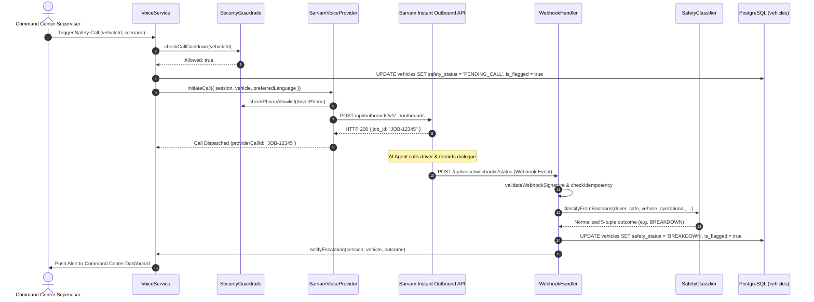

---

## 37. Track 4 Classification & 5-Tuple Boolean Matrix

The classification engine (`server/voice/safetyClassifier.js`) deterministically maps conversation outcomes to a canonical **5-Tuple Boolean Matrix**:

$$\text{Outcome Matrix} = \langle \text{driverSafe}, \text{vehicleOperational}, \text{roadPassable}, \text{assistanceRequired}, \text{escalationRequired} \rangle$$

### Authoritative Status Matrix
| Outcome Key | Driver Safe? | Vehicle Operational? | Road Passable? | Assistance Required? | Escalation Required? |
| :--- | :---: | :---: | :---: | :---: | :---: |
| `SAFE` | `true` | `true` | `true` | `false` | `false` |
| `DELAYED` | `true` | `true` | `true` | `false` | `false` |
| `BREAKDOWN` | `true` | `false` | `true` | `true` | **`true`** |
| `ROAD_BLOCKED` | `true` | `true` | `false` | `false` | `false` |
| `ASSISTANCE_REQUIRED` | `false` | `false` | `false` | `true` | **`true`** |
| `NO_RESPONSE` | `false` | `false` | `true` | `true` | **`true`** |
| `UNKNOWN` | `false` | `false` | `false` | `true` | **`true`** |

---

## 38. Sarvam AI Instant Outbound Telephony Integration

The `SarvamVoiceProvider` (`server/voice/providers/sarvamVoiceProvider.js`) connects Project Brahmaputra to Sarvam AI's conversational voice infrastructure.

### Request Payload Architecture
```json
{
  "app_config": {
    "app_id": "sarvam_agent_id",
    "app_version": 1,
    "app_type": "agent",
    "connection_config": {
      "connection_id": "sarvam_connection_id",
      "agent_phone_number": "+919999999999"
    },
    "agent_variables": {
      "driver_name": "B. Kalita",
      "vehicle_id": "VEH-NER-101",
      "flag_reason": "Vehicle delayed near active corridor disruption"
    }
  },
  "user_config": {
    "user_phone_number": "+919864012345"
  },
  "webhook_config": {
    "url": "https://api.brahmaputra.gov.in/api/voice/webhooks/status",
    "metadata": {
      "vehicle_id": "VEH-NER-101",
      "internal_call_id": "CALL-NER-0101"
    }
  }
}
```

---

## 39. Track 4 Telephony State Machine & Webhooks

The webhook handler (`server/voice/webhookHandler.js`) enforces strict state machine transitions to guarantee data integrity across asynchronous telephony events:

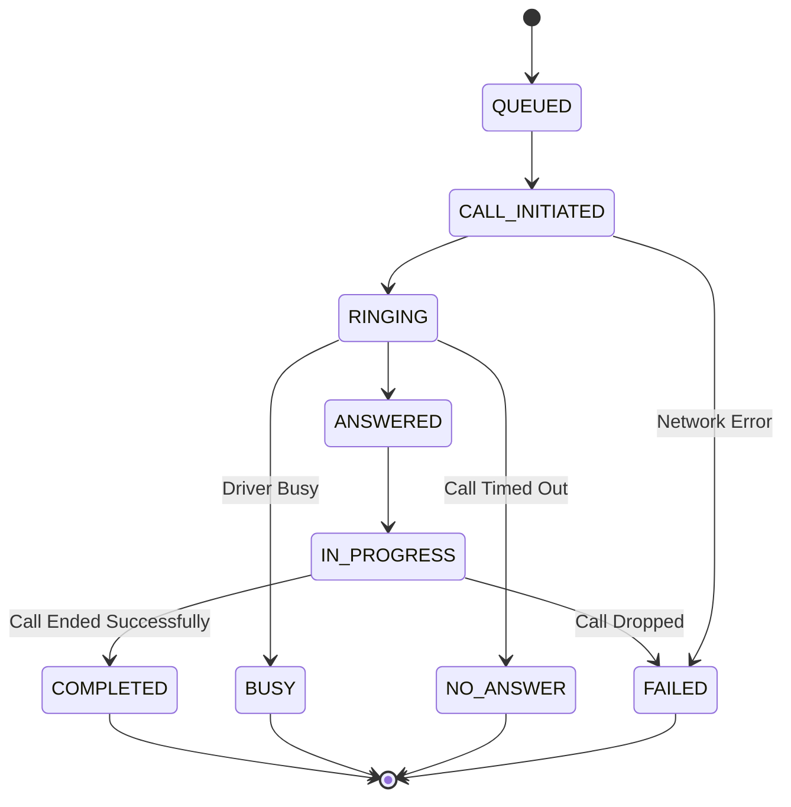

---

## 40. Track 4 Safety Guardrails & PII Protection

1. **PII Masking (`maskPhone`)**: Driver telephone numbers are masked before returning API responses (e.g. `+91-98640-XXXXX`), protecting driver privacy in shared operator dashboards.
2. **Call Cooldowns (`checkCallCooldown`)**: Enforces a minimum cooldown (default 2 minutes) between successive calls to the same vehicle to prevent driver harassment.
3. **Allowlist Enforcement (`checkPhoneAllowlist`)**: When `SARVAM_LIVE_CALLS_ENABLED=true`, calls are strictly restricted to phone numbers registered in `SARVAM_ALLOWED_TEST_NUMBERS` unless explicitly disabled via `ENFORCE_SARVAM_CALL_ALLOWLIST=false`.
4. **Idempotency & Deduplication**: Webhook handler maintains an in-memory cache with 15-minute TTL to ignore duplicate webhook deliveries from telephony providers.

---

## 41. Database Schema & Table DDL Reference

The PostgreSQL database schema (`server/db/schema.js`) defines three core tables:

### 1. `users` Table
```sql
CREATE TABLE IF NOT EXISTS users (
  id VARCHAR(64) PRIMARY KEY,
  full_name VARCHAR(128) NOT NULL,
  email VARCHAR(255) UNIQUE NOT NULL,
  password_hash VARCHAR(255) NOT NULL,
  role VARCHAR(32) NOT NULL DEFAULT 'USER',
  is_active BOOLEAN NOT NULL DEFAULT TRUE,
  created_at TIMESTAMPTZ NOT NULL DEFAULT NOW(),
  updated_at TIMESTAMPTZ NOT NULL DEFAULT NOW()
);
CREATE INDEX IF NOT EXISTS idx_users_email ON users(email);
CREATE INDEX IF NOT EXISTS idx_users_role ON users(role);
```

### 2. `vehicles` Table
```sql
CREATE TABLE IF NOT EXISTS vehicles (
  id VARCHAR(64) PRIMARY KEY,
  owner_user_id VARCHAR(64) REFERENCES users(id) ON DELETE RESTRICT,
  reg_number VARCHAR(64) NOT NULL,
  name VARCHAR(255) NOT NULL,
  type VARCHAR(128) NOT NULL,
  capacity VARCHAR(64) NOT NULL,
  cargo VARCHAR(255) NOT NULL,
  status VARCHAR(64) NOT NULL DEFAULT 'AVAILABLE',
  speed_km_h INTEGER NOT NULL DEFAULT 45,
  origin VARCHAR(128) NOT NULL,
  destination VARCHAR(128),
  lat DOUBLE PRECISION,
  lng DOUBLE PRECISION,
  assigned_corridor VARCHAR(128),
  delay_est_minutes INTEGER NOT NULL DEFAULT 0,
  priority VARCHAR(64) NOT NULL DEFAULT 'MEDIUM',
  driver_name VARCHAR(128) NOT NULL DEFAULT 'Driver',
  driver_phone VARCHAR(64) NOT NULL,
  is_flagged BOOLEAN NOT NULL DEFAULT FALSE,
  flag_reason TEXT,
  safety_status VARCHAR(64) NOT NULL DEFAULT 'NOT_CHECKED',
  last_safety_check TIMESTAMPTZ,
  active_call_id VARCHAR(64),
  created_at TIMESTAMPTZ NOT NULL DEFAULT NOW(),
  updated_at TIMESTAMPTZ NOT NULL DEFAULT NOW()
);
CREATE INDEX IF NOT EXISTS idx_vehicles_owner_user_id ON vehicles(owner_user_id);
CREATE UNIQUE INDEX IF NOT EXISTS idx_vehicles_reg_number_unique ON vehicles(LOWER(reg_number));
```

### 3. `deployments` Table
```sql
CREATE TABLE IF NOT EXISTS deployments (
  id VARCHAR(64) PRIMARY KEY,
  vehicle_id VARCHAR(64) NOT NULL REFERENCES vehicles(id) ON DELETE RESTRICT,
  origin VARCHAR(128) NOT NULL,
  destination VARCHAR(128) NOT NULL,
  assigned_corridor VARCHAR(128) NOT NULL DEFAULT 'NH-27',
  status VARCHAR(64) NOT NULL DEFAULT 'ACTIVE',
  cargo VARCHAR(255) NOT NULL DEFAULT 'General Relief Goods',
  priority VARCHAR(64) NOT NULL DEFAULT 'MEDIUM',
  origin_lat DOUBLE PRECISION,
  origin_lng DOUBLE PRECISION,
  destination_lat DOUBLE PRECISION,
  destination_lng DOUBLE PRECISION,
  started_at TIMESTAMPTZ NOT NULL DEFAULT NOW(),
  completed_at TIMESTAMPTZ,
  created_at TIMESTAMPTZ NOT NULL DEFAULT NOW(),
  updated_at TIMESTAMPTZ NOT NULL DEFAULT NOW()
);
CREATE INDEX IF NOT EXISTS idx_deployments_vehicle_id ON deployments(vehicle_id);
CREATE INDEX IF NOT EXISTS idx_deployments_status ON deployments(status);
CREATE INDEX IF NOT EXISTS idx_deployments_created_at ON deployments(created_at);
CREATE UNIQUE INDEX IF NOT EXISTS idx_active_deployment_per_vehicle
ON deployments (vehicle_id)
WHERE status IN ('PLANNED', 'ACTIVE', 'DELAYED');
```

---

## 42. Entity-Relationship Diagram (ERD)

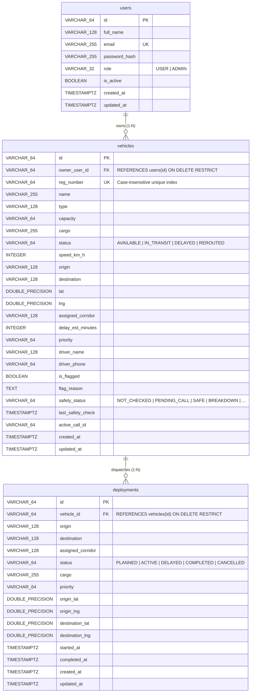

---

## 43. Database Modes & Persistence Lifecycle

The backend supports two operating modes via the repository pattern:
1. **Production PostgreSQL Mode**: Activated whenever `DATABASE_URL` is configured. Connects to hosted PostgreSQL, verifies schema idempotency, and persists all users, vehicles, and deployments. If `DATABASE_URL` is set but unreachable, **startup terminates with a fatal exit** to prevent silent data loss.
2. **In-Memory Development Mode**: Activated when `DATABASE_URL` is omitted. Uses in-memory array stores for local test execution without external database requirements.

---

## 44. Complete Backend REST API Reference

### 1. Authentication & Identity Domain
| Method | Endpoint | Auth | Role | Description |
| :--- | :--- | :--- | :--- | :--- |
| `POST` | `/api/auth/register` | None | Public | Register new `USER` account. Client `role` ignored. |
| `POST` | `/api/auth/login` | None | Public | Authenticate user/admin, returns JWT bearer token. |
| `GET` | `/api/auth/me` | Bearer | Authenticated | Retrieve authenticated user profile (`toSafeUser`). |
| `POST` | `/api/auth/logout` | None | Public | Invalidate authenticated session. |

### 2. Vehicle Fleet Management Domain
| Method | Endpoint | Auth | Role | Description |
| :--- | :--- | :--- | :--- | :--- |
| `GET` | `/api/vehicles` | Optional | Scoped | `USER`: returns owned vehicles. `ADMIN`: returns all. |
| `GET` | `/api/vehicles/:id` | Optional | Scoped | `USER`: 404 if not owned. `ADMIN`: returns any unit. |
| `POST` | `/api/vehicles` | Bearer | Scoped | `USER`: forces `owner_user_id = req.user.id`. |
| `PUT` | `/api/vehicles/:id` | Bearer | Scoped | Update driver, phone, status. Ownership immutable. |
| `DELETE`| `/api/vehicles/:id` | Bearer | Scoped | Decommission vehicle (guarded against active trips).|

### 3. Deployments & Journey Management Domain
| Method | Endpoint | Auth | Role | Description |
| :--- | :--- | :--- | :--- | :--- |
| `GET` | `/api/deployments` | Optional | Scoped | List deployments (`?status=ACTIVE&vehicleId=...`). |
| `GET` | `/api/deployments/:id` | Optional | Scoped | Get single deployment details. |
| `GET` | `/api/vehicles/:vehicleId/deployments`| Optional | Scoped | Get all deployments for specific vehicle. |
| `POST` | `/api/deployments` | Bearer | Scoped | Dispatch vehicle on new journey. |
| `POST` | `/api/deployments/:id/start` | Bearer | Scoped | Transition planned deployment to `ACTIVE`. |
| `POST` | `/api/deployments/:id/complete` | Bearer | Scoped | Complete journey, frees vehicle to `AVAILABLE`. |
| `POST` | `/api/deployments/:id/cancel` | Bearer | Scoped | Cancel journey, returns vehicle to `AVAILABLE`. |

### 4. Incident Reporting & Disruption Domain
| Method | Endpoint | Auth | Role | Description |
| :--- | :--- | :--- | :--- | :--- |
| `GET` | `/api/incidents` | Optional | Scoped | List verified alerts + own unverified reports. |
| `GET` | `/api/incidents/:id` | Optional | Scoped | Get single incident details. |
| `POST` | `/api/incidents` | Optional | Scoped | Submit manual field hazard report. |
| `POST` | `/api/incidents/verify` | None | Public/Auth | Multipart photo upload for Groq AI Vision check. |
| `GET` | `/api/alerts` | None | Public | List active emergency broadcast advisories. |

### 5. Tactical Route Planning & KPIs
| Method | Endpoint | Auth | Role | Description |
| :--- | :--- | :--- | :--- | :--- |
| `POST` | `/api/routes/plan` | None | Public | Compute optimal tactical route avoiding hazards. |
| `GET` | `/api/kpis` | None | Public | Retrieve aggregated regional logistics KPIs. |
| `GET` | `/api/weather` | None | Public | Retrieve corridor weather telemetry. |
| `GET` | `/api/health` | None | Public | Backend health check and environment verification. |

### 6. Track 4 AI Voice Safety Domain
| Method | Endpoint | Auth | Role | Description |
| :--- | :--- | :--- | :--- | :--- |
| `GET` | `/api/voice/config` | None | Public | Get active voice provider runtime config. |
| `POST` | `/api/voice/flag-vehicle` | Bearer | `ADMIN` | Flag/unflag vehicle for safety check. |
| `POST` | `/api/voice/calls/trigger` | Bearer | `ADMIN` | Trigger automated voice safety call. |
| `GET` | `/api/voice/calls` | None | Scoped | List all safety call sessions. |
| `GET` | `/api/voice/calls/:callId`| None | Scoped | Get single call transcript and 5-tuple outcome. |
| `POST` | `/api/voice/calls/:callId/resolve` | Bearer | `ADMIN` | Resolve operator escalation with supervisory notes. |
| `POST` | `/api/voice/simulate-call`| Bearer | `ADMIN` | Development helper for instant outcome testing. |
| `POST` | `/api/voice/webhooks/status` | Secret | Telephony | Inbound status webhook callback from Sarvam. |
| `POST` | `/api/voice/webhooks/speech` | Secret | Telephony | Inbound speech turn webhook from telephony. |

---

## 45. Frontend Component Inventory & Hierarchy

```
App.jsx (Root Router & Intelligent Redirects)
├── AuthProvider (AuthContext)
└── AppProvider (AppContext)
    │
    ├── /login (LoginPage)
    │   ├── AuthBackgroundLandscape
    │   └── IconEye / IconEyeOff Password Toggle
    │
    ├── /register (RegisterPage)
    │   ├── AuthBackgroundLandscape
    │   └── IconEye / IconEyeOff Password Toggle
    │
    ├── /user/dashboard (UserLayout -> UserDashboard)
    │   ├── MobileAppHeader
    │   ├── QuickActionGrid
    │   ├── MapplsGISMap (Leaflet Spatial Engine)
    │   ├── UserDeploymentsView (Ongoing, Upcoming, History Tabs)
    │   ├── UserVehicleManager (Fleet Directory & Actions)
    │   ├── UserRegisterVehicleModal
    │   ├── UserDeployModal
    │   ├── UserReportIncidentModal
    │   ├── RoutePlannerModal
    │   └── UserMobileNav (Bottom Bar)
    │
    └── /admin/dashboard (AdminLayout -> AdminDashboard)
        ├── Navbar (Global Header & IST Clock)
        ├── CommandCenterKPIs (InfoPopover Metrics)
        ├── MapplsGISMap (Leaflet Spatial Engine)
        ├── DistrictAccessibility (16-District Scorecard)
        ├── CorridorTelemetryLedger (Tabbed Master Ledger)
        ├── VehicleManager (Universal Fleet Directory)
        ├── DeployVehicleModal
        ├── DeploymentDetailsModal
        ├── DriverSafetyModal (Track 4 Voice Agent Controller)
        ├── IncidentReportingModal (Groq Vision AI)
        ├── RoutePlannerModal
        └── AdminMobileNav (Bottom Bar)
```

---

## 46. Backend Module & Service Inventory

- `server/index.js`: Main Express HTTP application, middleware, route controllers, static SPA serving, and graceful server startup.
- `server/auth/authMiddleware.js`: JWT token verification (`authenticateUser`), role enforcement (`requireRole`), and optional auth parser (`optionalAuth`).
- `server/auth/authUtils.js`: Cryptographic helpers: bcrypt hashing, JWT signing/verifying, email validation, and safe user serialization.
- `server/db/db.js`: PostgreSQL connection pool management (`getPool`), connection testing (`testConnection`), and error sanitization.
- `server/db/schema.js`: DDL schema definitions, table migrations, geodetic hub coordinate resolver (`resolveLocationCoordinates`), and seed data.
- `server/db/userRepository.js`: User entity persistence, email lookups, and account creation.
- `server/db/vehicleRepository.js`: Authoritative vehicle repository layer supporting PostgreSQL and memory modes, active deployment projection, and anti-IDOR checks.
- `server/db/deploymentRepository.js`: Journey lifecycle repository managing active deployment constraints, starts, completions, and cancellations.
- `server/voice/voiceService.js`: Track 4 orchestrator managing call sessions, persistent state updates, cooldown checks, and escalation dispatching.
- `server/voice/safetyClassifier.js`: Deterministic classifier mapping driver utterances to the canonical 5-tuple boolean status matrix.
- `server/voice/securityGuardrails.js`: PII phone masking, E.164 phone normalization, and per-vehicle call cooldown timers.
- `server/voice/agentPrompt.js`: Multilingual prompt templates (English, Hindi, Assamese, Bengali), mandatory AI identity disclosures, and guardrails.
- `server/voice/webhookHandler.js`: Telephony state machine, webhook signature authentication, and idempotency deduplication.
- `server/voice/providers/sarvamVoiceProvider.js`: Production adapter for Sarvam AI Instant Outbound telephony API.
- `server/voice/providers/voiceProviderFactory.js`: Factory instantiating active voice provider based on `VOICE_PROVIDER` environment variable.

---

## 47. System Data Flow Sequences

### 1. Vehicle Registration to Dispatch Flow
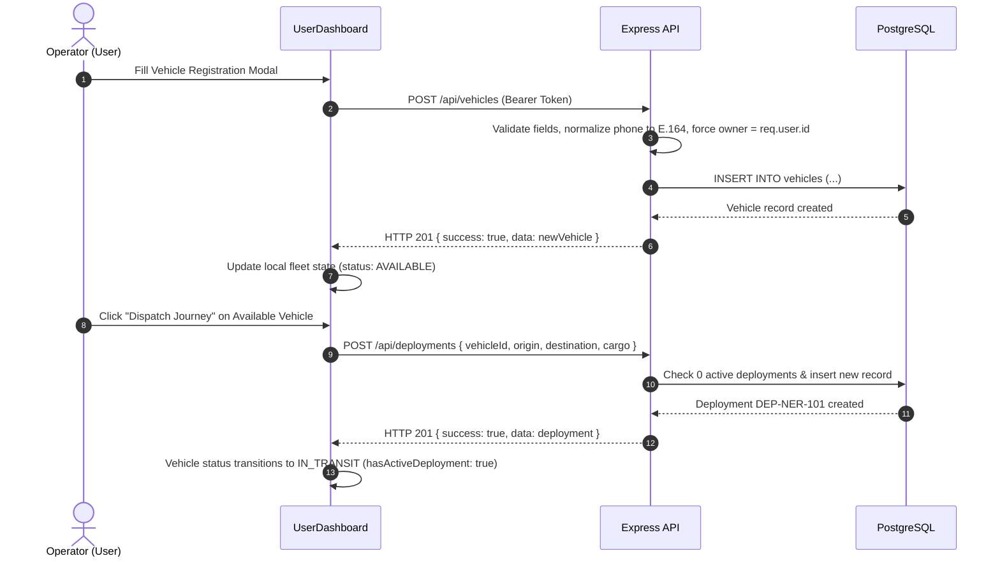

---

## 48. Progressive Web App (PWA) & Service Worker Architecture

Configured in `vite.config.js` using `vite-plugin-pwa`:
- **Display Mode**: `standalone` with `theme_color: '#0F172A'` and `background_color: '#F8FAFC'`.
- **Precached Assets**: All HTML, CSS, JavaScript, Webfonts, and SVG/PNG icons are precached for fast initial loading.
- **Runtime Caching Strategy**:
  - **`/api/*` Endpoints**: Strictly **`NetworkOnly`** with background sync retry queue (`ner-api-queue`), ensuring operational logistics data is never served stale.
  - **Google Fonts**: `StaleWhileRevalidate` for stylesheets; `CacheFirst` (1-year TTL) for webfont binaries (`.woff2`).
- **PWA Icons**: Complete icon suite in `public/` (192px, 512px, 512px maskable, 180px Apple touch).

---

## 49. Branding, Emblems & Visual Assets

- **Official Crest (`/assets/brahmaputra_emblem.png`)**: Circular golden-navy emblem representing the Government of India North Eastern Region logistics initiative.
- **Satellite Terrain Hero (`/assets/brahmaputra_hero.jpg`)**: High-resolution topographic visual of the Brahmaputra River Basin used on login and landing screens.
- **Logomark (`NER`)**: High-contrast circular brand badge on mobile headers and desktop navbars.

---

## 50. Responsive Design & Viewport Adaptations

| Viewport Breakpoint | Target Devices | Layout Adaptations |
| :--- | :--- | :--- |
| **Mobile (`< 640px`)** | Smartphones (Android / iPhone) | Single-column stacked cards, 2×2 KPI grid, sticky top header, persistent bottom navigation rail (`UserMobileNav`), horizontal state filter scrolling, modal bottom sheets. |
| **Tablet (`640px - 1023px`)** | iPads, Android tablets | 2-column card layouts, expanded map height (480px), multi-pill filter wrapping. |
| **Desktop (`≥ 1024px`)** | Laptops, Workstations | 4-column KPI grid, 6-column data tables with sticky headers, side-by-side GIS map and scorecard panels, desktop navbar with live IST clock. |

---

## 51. Interactive UI Component Behaviors & Micro-Interactions

- **Buttons**: Minimum 48px touch targets on mobile (`touch-target`), distinct active/hover states, loading spinners on form submission.
- **Status Chips (`StatusChip.jsx`)**: Semantic colored badges (`success`, `warning`, `danger`, `info`, `neutral`).
- **Password Toggle**: Icon button dynamically toggling between text and password masks with full keyboard focus support.
- **Toast Notifications**: Floating alert popups sliding in from top-right on admin dashboard to confirm async actions.

---

## 52. Design System & Semantic Color Tokens

| Semantic Role | Token / Class | Hex Code | Purpose & Meaning |
| :--- | :--- | :--- | :--- |
| **Primary Navy** | `bg-[#0B1220]` / `text-[#0B1220]` | `#0B1220` | Core brand identity, primary text, dark headers. |
| **Operational Blue**| `bg-[#2563EB]` / `text-[#2563EB]` | `#2563EB` | Active route overlays, dispatch CTA buttons, in-transit badges. |
| **Hazard Critical** | `bg-[#DC2626]` / `text-[#DC2626]` | `#DC2626` | Blocked corridors, critical landslides, emergency distress. |
| **Caution Amber** | `bg-[#D97706]` / `text-[#D97706]` | `#D97706` | Single-lane traffic, mud slush, watch districts, delayed trips. |
| **Success Emerald** | `bg-[#16A34A]` / `text-[#16A34A]` | `#16A34A` | Open corridors, accessible districts ($\ge 85\%$), safe vehicles. |
| **Surface Canvas** | `bg-[#F5F7FA]` | `#F5F7FA` | Universal background substrate. |

---

## 53. Iconography System

Centralized in `src/components/common/AppIcons.jsx`:
- `IconHome`, `IconMap`, `IconDeployments`, `IconTruck`, `IconMore`, `IconWarning`, `IconShield`, `IconPlus`, `IconRoute`, `IconUser`, `IconDocument`, `IconInfo`, `IconRefresh`, `IconEye`, `IconEyeOff`, `IconMail`, `IconLock`, `IconClose`.

---

## 54. Temporal Handling & IST Formatting

All timestamps are stored in UTC in PostgreSQL (`TIMESTAMPTZ`) and formatted for user presentation in **Indian Standard Time (IST / Asia/Kolkata)** via `src/utils/timeFormat.js`:
- `formatIST(date, 'full')`: `23 Sep 2026, 10:42 PM IST`
- `formatIST(date, 'timeOnly')`: `10:42 PM IST`
- `formatIST(date, 'relative')`: `Just now` / `15 min ago` / `2 hr ago`
- `getCurrentISTClock()`: `10:42:15 PM IST` (Live navbar clock)

---

## 55. System Error Handling & Recovery Protocols

1. **Authentication Failures**: Generic "Invalid email or password" prevents account enumeration.
2. **Expired Tokens**: Intercepted by `authMiddleware` returning 401; frontend clears `localStorage` and redirects to `/login`.
3. **Database Disconnections**: If `DATABASE_URL` fails during startup, process logs a sanitized error and exits with non-zero code.
4. **Duplicate Plate Registration**: Catches PostgreSQL unique constraint `idx_vehicles_reg_number_unique` (code `23505`) and returns `HTTP 409 Conflict`.
5. **AI Vision Timeouts**: Groq API calls timeout after 35 seconds with clear fallback messaging.

---

## 56. Empty State Handling Across Views

- **Zero Vehicles Registered**: Shows onboarding card encouraging asset enrollment.
- **Zero Available Vehicles**: Informs operator that all fleet units are deployed.
- **Zero Active Deployments**: Displays depot status message with direct dispatch button.
- **Zero Active Alerts**: Green nominal banner confirming all regional corridors are clear.

---

## 57. Security Architecture & Defensive Hardening

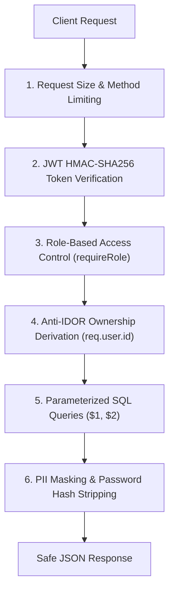

---

## 58. Environment Variable Matrix

| Variable Name | Component | Required in Production? | Description |
| :--- | :--- | :---: | :--- |
| `PORT` | Backend | Optional (Default: 5000) | Port for Express HTTP server. |
| `DATABASE_URL` | Backend | **Required for Persistence** | PostgreSQL connection string. |
| `JWT_SECRET` | Backend | **Mandatory in Production** | HMAC-SHA256 secret key for signing tokens. |
| `ADMIN_INITIAL_EMAIL` | Backend | Optional | Bootstrap email for initial admin account. |
| `ADMIN_INITIAL_PASSWORD`| Backend | Optional | Bootstrap password for initial admin account. |
| `ADMIN_INITIAL_NAME` | Backend | Optional | Display name for bootstrap admin. |
| `GROQ_API_KEY` | Backend | Optional (AI Vision/Routes) | API key for Groq Cloud LLM inference. |
| `GROQ_VISION_MODEL` | Backend | Optional | Model identifier (Default: `qwen/qwen3.8-27b`). |
| `VOICE_PROVIDER` | Backend | Optional (Default: `mock`) | Active voice provider (`mock`, `sarvam`, `real-skeleton`). |
| `SARVAM_API_KEY` | Backend | Required for Live Sarvam | Sarvam AI authentication token. |
| `SARVAM_ORG_ID` | Backend | Required for Live Sarvam | Sarvam organization identifier. |
| `SARVAM_WORKSPACE_ID` | Backend | Required for Live Sarvam | Sarvam workspace identifier. |
| `SARVAM_AGENT_ID` | Backend | Required for Live Sarvam | Sarvam Agent ID. |
| `SARVAM_AGENT_VERSION`| Backend | Optional (Default: 1) | Positive integer version of Sarvam agent. |
| `SARVAM_CONNECTION_ID`| Backend | Required for Live Sarvam | Telephony connection identifier. |
| `SARVAM_AGENT_PHONE_NUMBER`| Backend | Required for Live Sarvam| E.164 caller phone number. |
| `SARVAM_LIVE_CALLS_ENABLED`| Backend| Optional (Default: false)| Safe mode switch (true = live calls, false = dry run). |
| `SARVAM_ALLOWED_TEST_NUMBERS`| Backend| Optional | Comma-separated list of permitted destination numbers. |
| `ENFORCE_SARVAM_CALL_ALLOWLIST`| Backend| Optional (Default: true) | Strict allowlist enforcement switch. |
| `VITE_API_BASE_URL` | Frontend | Optional | Base URL for backend API. |
| `VITE_MAPPLS_API_KEY` | Frontend | Optional | Map tiles API key (falls back to clean OpenStreetMap). |

---

## 59. External Integrations & Third-Party Service Dependencies

| External Service | Integration Role | Failure / Fallback Behavior |
| :--- | :--- | :--- |
| **PostgreSQL** | Authoritative relational data persistence | Fails startup in production; in-memory fallback in dev if unset. |
| **Groq Cloud API** | Multimodal AI vision & route planning | Graceful local heuristic fallback if Groq times out or key is unset. |
| **Sarvam AI** | Outbound conversational telephony | Returns dry-run queued payload if live calls disabled or key unset. |
| **OpenStreetMap** | High-contrast cartography tiles | Free, highly reliable tile servers; zero key requirement. |

---

## 60. Mock, Fixture & Fallback Audit

| Artifact / Key | Classification | Location | Runtime Policy |
| :--- | :--- | :--- | :--- |
| `INITIAL_NER_VEHICLES` | **Reference Data** | `server/db/schema.js` | Used only for explicit dev seeding; never overwrites production DB. |
| `INITIAL_NER_DEPLOYMENTS`| **Reference Data** | `server/db/schema.js` | Reference demonstration trips. |
| `NER_CITIES` / `NER_DISTRICTS`| **Reference Data** | `src/data/nerData.js` | Canonical geographical metadata for all 8 NE states. |
| `MockVoiceProvider` | **Dev / Test Only** | `server/voice/providers/mockVoiceProvider.js` | Active only when `VOICE_PROVIDER=mock`. |

---

## 61. Automated Test Suite & Verification Inventory

The repository includes **36 automated test suites** covering all critical system contracts:
1. `auth_security.test.js`: Password hashing, JWT issuance, production secret enforcement, zero-fallback admin credentials.
2. `ownership_access_control.test.js`: Anti-IDOR enforcement, tenant isolation, anti-enumeration 404 responses.
3. `vehicle_repository.test.js`: PostgreSQL CRUD, active deployment projections, registration uniqueness.
4. `deployment_availability_lifecycle.test.js`: 1:N asset-to-trip lifecycle, single active trip constraints.
5. `gis_ownership_incident_origin_acceptance.test.js`: Geodetic coordinate resolution, Leaflet marker scoping.
6. `sarvam_voice_provider.test.js`: Sarvam outbound request formatting, allowlist protection, dry-run safety mode.
7. `webhook_state_machine.test.js`: Telephony state machine transitions, signature verification, idempotency.
8. `pwa_manifest_mobile.test.js`: PWA manifest, service worker Workbox caching, mobile touch targets.
9. `password_visibility_toggle.test.js`: Eye open/close toggle state and accessibility.
10. `district_scorecard_responsive.test.js`: Accessibility formula verification, responsive scorecard wrapping.

---

## 62. Complete End-to-End Lifecycle Scenario

```
1. Operator creates account (POST /api/auth/register) -> Enforced as USER.
2. Operator signs in (POST /api/auth/login) -> Receives JWT token.
3. Operator registers vehicle AS-01-GC-4482 at Guwahati Hub -> Stored in PostgreSQL.
4. Vehicle is staged at depot (Status: AVAILABLE).
5. Operator dispatches vehicle to Silchar (POST /api/deployments).
6. Vehicle becomes IN_TRANSIT (Deployment: ACTIVE).
7. Leaflet GIS cartography updates with vehicle marker at Guwahati origin.
8. Landslide reported at Sonapur Tunnel (NH-6) -> AI Vision verifies photograph.
9. Sonapur roadblock alert broadcast to all operators.
10. Admin flags vehicle and triggers Track 4 AI Voice Check.
11. Sarvam AI calls driver, records dialogue, classifies status as BREAKDOWN.
12. Admin resolves escalation, assigns mechanic unit.
13. Vehicle reaches Silchar Distribution Depot -> Operator completes deployment.
14. Trip marked COMPLETED in audit history; vehicle returns to AVAILABLE.
```

---

## 63. Multi-Tenant Isolation Example: User A vs. User B vs. Admin

```
[Tenant Isolation Matrix]
User A (Pharma Fleet):
- Owns Vehicle A1 (AS-01-AA-1111) & Deployment D1
- CANNOT see, modify, or delete Vehicle B1 (Returns HTTP 404)
- CANNOT dispatch Vehicle B1 (Returns HTTP 404)

User B (Food Supply):
- Owns Vehicle B1 (ML-05-BB-2222) & Deployment D2
- CANNOT see, modify, or delete Vehicle A1 (Returns HTTP 404)
- CANNOT dispatch Vehicle A1 (Returns HTTP 404)

Admin (Command Center):
- Sees Vehicle A1, Vehicle B1, Deployment D1, Deployment D2
- Can trigger Track 4 AI Voice Safety Checks on all units
- Receives all verified and unverified regional hazard alerts
```

---

## 64. Domain State Transition Diagrams

### 1. Deployment State Transitions
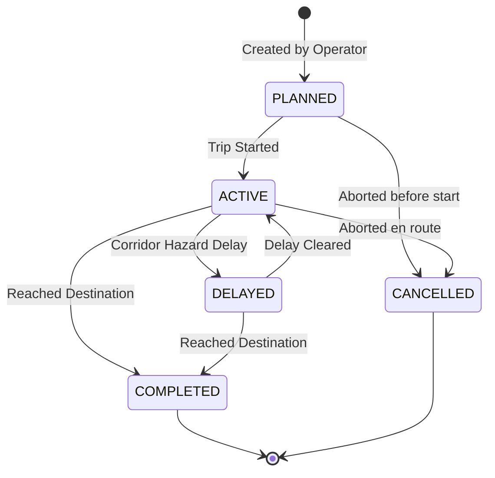

---

## 65. Data Source & Refresh Strategy Matrix

| Feature / UI Component | Data Source | API Endpoint | Refresh Strategy | Fallback Strategy |
| :--- | :--- | :--- | :--- | :--- |
| **Fleet Vehicles** | PostgreSQL `vehicles` | `GET /api/vehicles` | Hydrates on mount & user change | Empty fleet state |
| **Deployments** | PostgreSQL `deployments`| `GET /api/deployments`| Hydrates on mount & trip changes | Empty trips state |
| **GIS Cartography** | Leaflet + DB + OSM | `GET /api/vehicles`, `/incidents` | Auto-updates with state | Cached OSM tiles |
| **Regional Alerts** | Server Alert Registry | `GET /api/alerts` | Hydrates on mount & WebSocket/poll | Zero alerts banner |
| **Weather Telemetry** | Server Weather Feed | `GET /api/weather` | Hydrates on mount | Baseline NER climate |

---

## 66. Source Code File Implementation Index

### Authentication & RBAC
- [`server/auth/authUtils.js`](file:///c:/Users/Madhu/OneDrive/Documents/SIHNER/server/auth/authUtils.js)
- [`server/auth/authMiddleware.js`](file:///c:/Users/Madhu/OneDrive/Documents/SIHNER/server/auth/authMiddleware.js)
- [`src/context/AuthContext.jsx`](file:///c:/Users/Madhu/OneDrive/Documents/SIHNER/src/context/AuthContext.jsx)
- [`src/components/auth/LoginPage.jsx`](file:///c:/Users/Madhu/OneDrive/Documents/SIHNER/src/components/auth/LoginPage.jsx)
- [`src/components/auth/RegisterPage.jsx`](file:///c:/Users/Madhu/OneDrive/Documents/SIHNER/src/components/auth/RegisterPage.jsx)
- [`src/components/auth/RoleRoute.jsx`](file:///c:/Users/Madhu/OneDrive/Documents/SIHNER/src/components/auth/RoleRoute.jsx)

### Vehicle & Deployment Persistence
- [`server/db/schema.js`](file:///c:/Users/Madhu/OneDrive/Documents/SIHNER/server/db/schema.js)
- [`server/db/vehicleRepository.js`](file:///c:/Users/Madhu/OneDrive/Documents/SIHNER/server/db/vehicleRepository.js)
- [`server/db/deploymentRepository.js`](file:///c:/Users/Madhu/OneDrive/Documents/SIHNER/server/db/deploymentRepository.js)
- [`server/db/userRepository.js`](file:///c:/Users/Madhu/OneDrive/Documents/SIHNER/server/db/userRepository.js)

### Track 4 AI Voice Subsystem
- [`server/voice/voiceService.js`](file:///c:/Users/Madhu/OneDrive/Documents/SIHNER/server/voice/voiceService.js)
- [`server/voice/safetyClassifier.js`](file:///c:/Users/Madhu/OneDrive/Documents/SIHNER/server/voice/safetyClassifier.js)
- [`server/voice/securityGuardrails.js`](file:///c:/Users/Madhu/OneDrive/Documents/SIHNER/server/voice/securityGuardrails.js)
- [`server/voice/webhookHandler.js`](file:///c:/Users/Madhu/OneDrive/Documents/SIHNER/server/voice/webhookHandler.js)
- [`server/voice/providers/sarvamVoiceProvider.js`](file:///c:/Users/Madhu/OneDrive/Documents/SIHNER/server/voice/providers/sarvamVoiceProvider.js)
- [`src/components/DriverSafetyModal.jsx`](file:///c:/Users/Madhu/OneDrive/Documents/SIHNER/src/components/DriverSafetyModal.jsx)

### Spatial Cartography & Scorecards
- [`src/components/MapplsGISMap.jsx`](file:///c:/Users/Madhu/OneDrive/Documents/SIHNER/src/components/MapplsGISMap.jsx)
- [`src/components/DistrictAccessibility.jsx`](file:///c:/Users/Madhu/OneDrive/Documents/SIHNER/src/components/DistrictAccessibility.jsx)
- [`src/components/RoutePlannerModal.jsx`](file:///c:/Users/Madhu/OneDrive/Documents/SIHNER/src/components/RoutePlannerModal.jsx)

---

## 67. Production Deployment (Render) Architecture

In production environments (such as Render Cloud):
- **Single Process Architecture**: Express serves both the backend REST API (`/api/*`) and static built frontend files (`dist/`).
- **Static SPA Catch-All**: Non-API routes serve `dist/index.html` to support client-side React Router navigation.
- **Port Binding**: Binds to `0.0.0.0` with `process.env.PORT` (Default: 5000).
- **Production Pre-Flight Enforcements**: Startup fails immediately if `NODE_ENV === 'production'` and `JWT_SECRET` is unset.

---

## 68. Server Startup & Pre-Flight Sequence

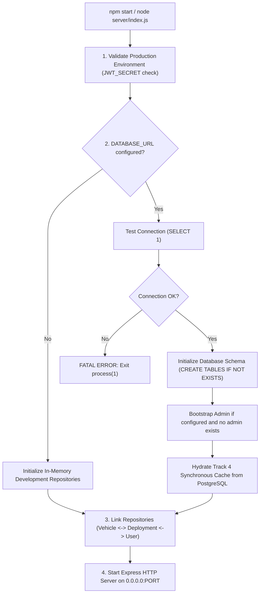

---

## 69. Local Development & Environment Setup

### 1. Prerequisites
- Node.js (v18.0.0 or higher)
- npm (v9.0.0 or higher)
- Optional: PostgreSQL (v14+) or Docker

### 2. Installation & Setup
```bash
# 1. Clone repository
git clone https://github.com/K4U5H1K-max/SweetChilly.git
cd SweetChilly

# 2. Install dependencies
npm install

# 3. Configure environment
cp .env.example .env
# Edit .env to set JWT_SECRET, GROQ_API_KEY, etc.

# 4. Run automated test suite
npm test

# 5. Start unified development server (Frontend + Backend concurrently)
npm run dev:full
```

---

## 70. Known Technical Limitations

1. **Simulated Telemetry**: Position resolution utilizes geodetic gateway coordinates and active trip origins rather than live hardware GPS OBD-II streams.
2. **Telephony Dry-Run Default**: `SARVAM_LIVE_CALLS_ENABLED` defaults to `false` (dry-run mode) to prevent accidental telephony charges during evaluation.
3. **Weather Telemetry Granularity**: Monitored across 8 regional corridor clusters rather than micro-kilometer weather sensors.

---

## 71. Comprehensive System Feature Matrix

| System Capability | Operator (`USER`) | Supervisor (`ADMIN`) | Backend Persistence | PWA / Mobile | External Service Dependency | Status |
| :--- | :---: | :---: | :---: | :---: | :---: | :--- |
| **JWT Authentication** | Yes | Yes | PostgreSQL | Yes | None | **Implemented** |
| **Self-Serve Registration** | Yes | N/A | PostgreSQL | Yes | None | **Implemented** |
| **Vehicle Enrollment** | Yes | Yes | PostgreSQL | Yes | None | **Implemented** |
| **Vehicle Directory & Search**| Scoped | Universal | PostgreSQL | Yes | None | **Implemented** |
| **Journey Dispatch (1:N)** | Scoped | Universal | PostgreSQL | Yes | None | **Implemented** |
| **Leaflet GIS Cartography** | Scoped | Universal | PostgreSQL / OSM | Yes | OpenStreetMap | **Implemented** |
| **AI Vision Incident Check** | Yes | Yes | In-Memory / DB | Yes | Groq AI Vision | **Implemented** |
| **Tactical Route Planner** | Yes | Yes | API / Heuristic | Yes | Groq Llama 3.3 | **Implemented** |
| **District Accessibility Card**| Yes | Yes | In-Memory / DB | Yes | None | **Implemented** |
| **Track 4 Voice Agent Audit** | No (403) | **Yes** | PostgreSQL | Yes | Sarvam AI | **Implemented** |
| **Telephony State Machine** | No | **Yes** | Server / DB | Yes | Telephony Webhook | **Implemented** |
| **Offline PWA Support** | Yes | Yes | Service Worker | **Yes** | Workbox | **Implemented** |

---

## 72. Unverified & Stale Documentation Findings

- **Python Redis/RQ Background Scrapers (`backend/app/`)**: The repository includes an auxiliary Python ingestion prototype designed to scrape GDELT and PIB news feeds. In the current primary operational runtime, the Node.js Express server (`server/index.js`) operates independently without requiring active Redis workers.

---

## 73. Technical Glossary

- **NER**: North Eastern Region of India (Assam, Meghalaya, Tripura, Manipur, Mizoram, Nagaland, Arunachal Pradesh, Sikkim).
- **PWA**: Progressive Web App; installable web application operating standalone on mobile devices.
- **RBAC**: Role-Based Access Control enforcing distinct capabilities for `USER` and `ADMIN` roles.
- **Anti-IDOR**: Insecure Direct Object Reference defense preventing cross-tenant access to unauthorized records.
- **1:N Asset-to-Journey Model**: Relational architecture where one physical vehicle owns multiple sequential historical deployment trips.
- **Track 4**: Autonomous driver safety AI subsystem conducting voice calls and classifying driver condition.
- **5-Tuple Matrix**: Canonical status vector $\langle \text{driverSafe}, \text{vehicleOperational}, \text{roadPassable}, \text{assistanceRequired}, \text{escalationRequired} \rangle$.
- **WGS-84**: World Geodetic System 1984; standard geodetic reference frame used for coordinates.
- **IST**: Indian Standard Time (`UTC+05:30` / `Asia/Kolkata`).
